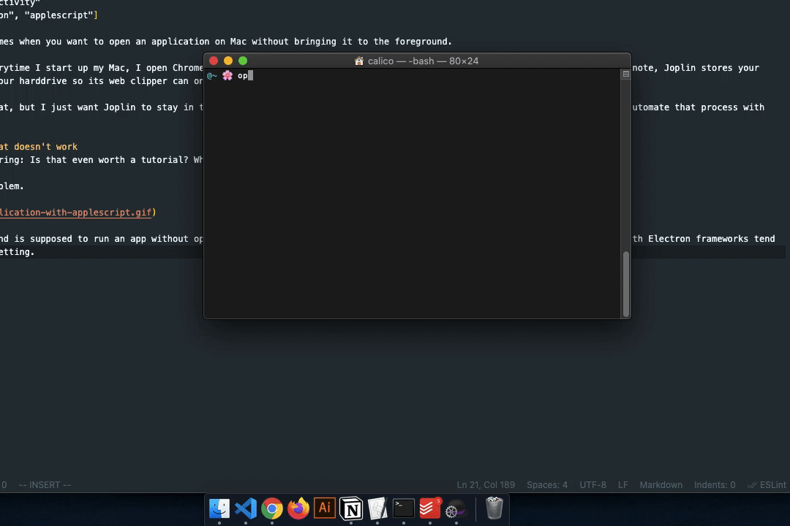
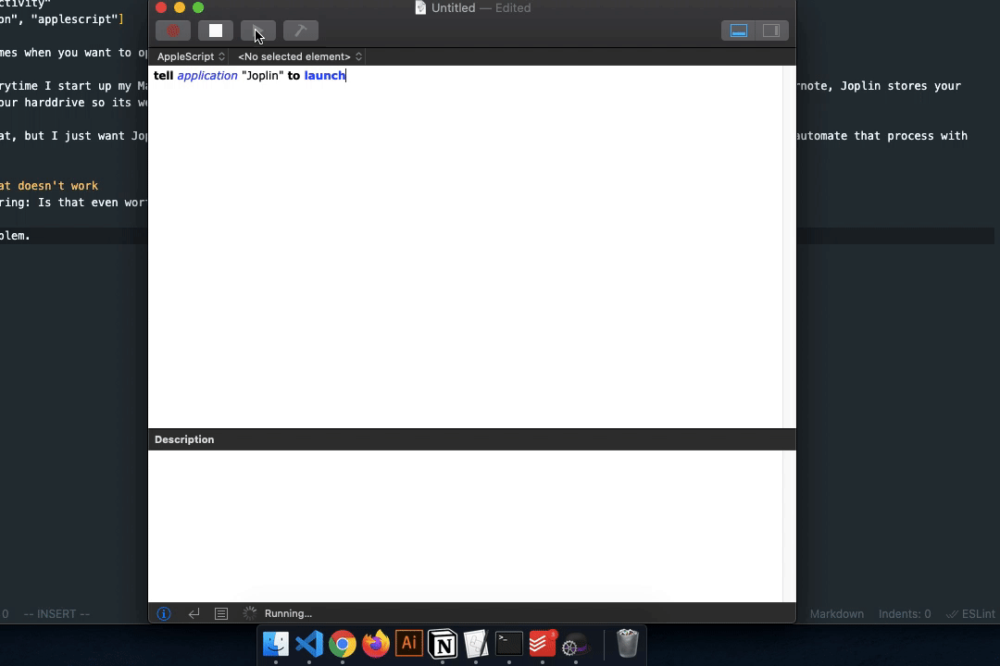
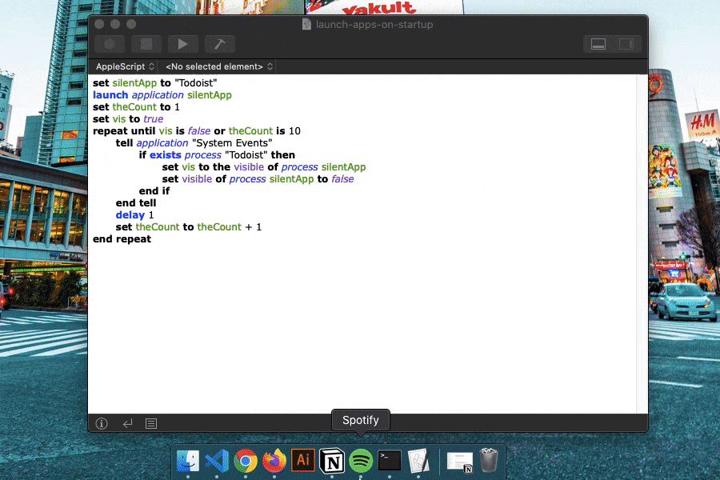
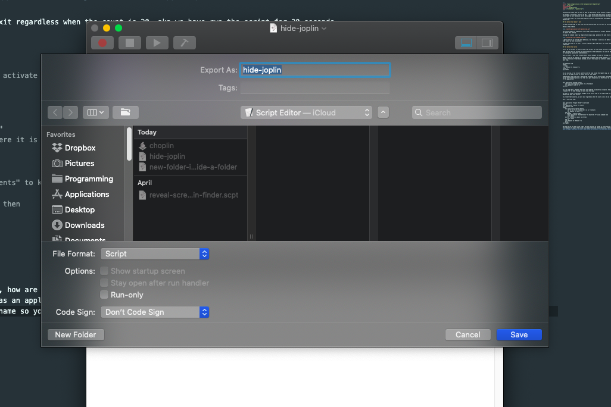

There are probably times when you want to open an application on Mac without having it steal your screen estate.

For example, everytime I start up my Mac, I open Chrome and then a bunch of work tools like:

- Visual Studio Code because I'm a developer,
- Notion for writing notes,
- Todoist for managing my todos,
- Joplin for saving any interesting articles I come across for future reference.

It's very easy to write a Mac Automator workflow to open a bunch of apps in one go. However, I'm looking beyond that basic setup. I just want to open Notion, Todoist and Joplin in the background and bring them to the frontmost whenever I need.

Hence I'm going to show you how to automate that process with Applescript.

## The traditional, unreliable method

The traditional way to open an app in the background is to open the Terminal and run this command:
`open -gj /Applications/Todoist.app`

It goes without saying the `open` is the command for opening files and directories. More importantly, the `g` flag tells the command to not bring the app to the foreground, while the `j` flag launches the app hidden.

Unfortunately, many apps I use seem to ignore those flags. Take a look at the screenshot below.



The same happens when I tried to launch an app silently with Applescript.



I don't know how to override that behaviour, but the least I can do is to detect if the Joplin app is in focus and tell the System Events to run `command + h` to hide Joplin as soon as possible.

You may think that it is such a trivial problem to get hung up on, but I use Joplin daily and don't want my screen to switch to an app that I don't need to use right away.

## The method that works

First, we launch the application, which is Todoist in this case.

Then we start a loop that iterates every second.

Making a loop at an interval is probably the trickiest step of the workflow. Iexpect Applescript to have a built-in method similar to `setInterval` in Javascript, but there is no such thing.

To work around that, I start the loop at 1, run my code, then delay for one second before incrementing the counter. The loop will stop as soon as the `vis` variable becomes false.

```
set silentApp to "Todoist"
launch application silentApp
set theCount to 1
set vis to true
repeat until vis is false or theCount is 10
	-- our logic here
	delay 1
	set theCount to theCount + 1
end repeat
```

As you can see, I've also set a variable named `vis` that represents the visiblity of the app in question. By default, it is true.

For every second, we are asking the System Events to check if the process Todoist exists. Indeed, it should exist as long as we have launched the app, but I add it as a caution. If the process exists, we do two things:

- Set the value of variable `vis` to equate the visiblity of process Todoist, which is `true`.
- Set the visiblity of process Todoist to false. This is synonymous with pressing `Cmd + H` keyboard combo to hide the app. is in the foreground.

In the next second, the process Todoist is false, and as a result the `vis` variable also becomes false. At this point, we exit the loop.

You can see that I've set up the loop to repeat until either the `vis` variable is false or we have run through 10 iterations.

Again, the latter is not necessary, but I just want to throw in extra caution since I can never be certain how Macs app are going to behave.

If we are not careful, we may end up with an infinite loop. That's too much hassle for a simple script that's supposed to save me time.

Here is the final code snippet.

```
set silentApp to "Todoist"
launch application silentApp
set theCount to 1
set vis to true
repeat until vis is false or theCount is 10
	tell application "System Events"
		if exists process "Todoist" then
			set vis to the visible of process silentApp
			set visible of process silentApp to false
		end if
	end tell
	delay 1
	set theCount to theCount + 1
end repeat
```

Here's the fruit of our code


Now that we've got the script right, how are we going to invoke it every time we booted our Mac without opening the Applescript editor? To do that, please to to Fie > Export and export the script as an application and check “Run only”. That ensures the script editor won't be opened when the run the app. Also, remember to give the app a memorable and short name so you can invoke it from Spotlight easily.


