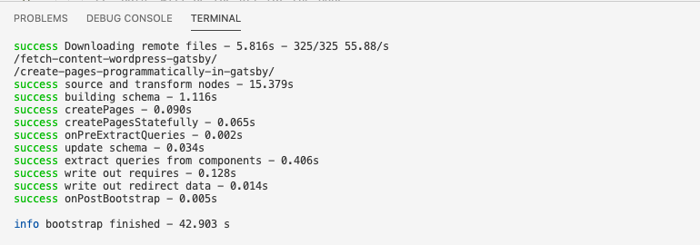
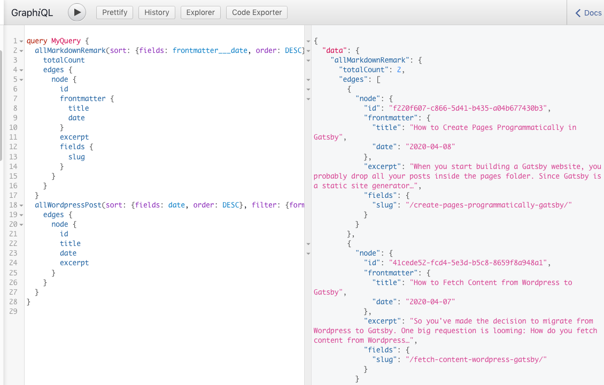
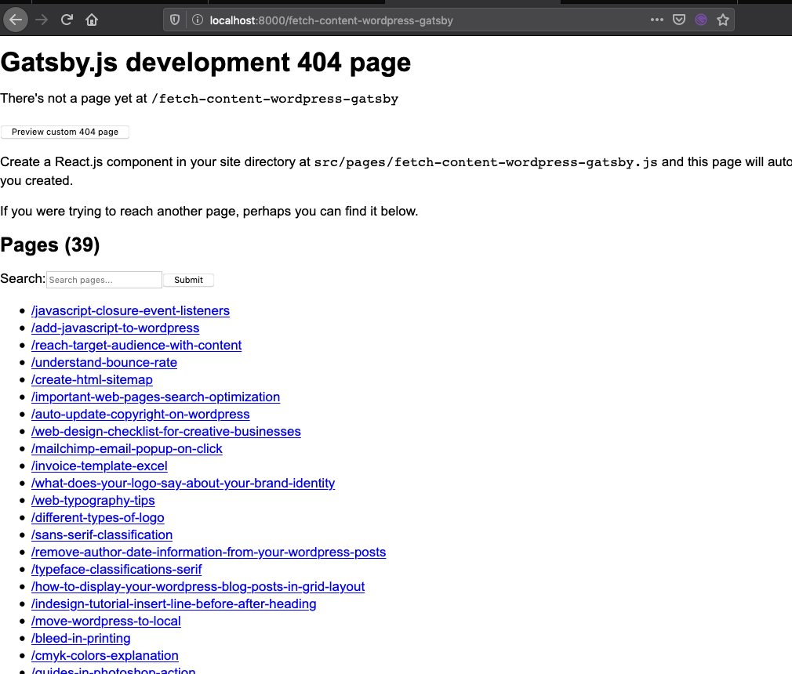
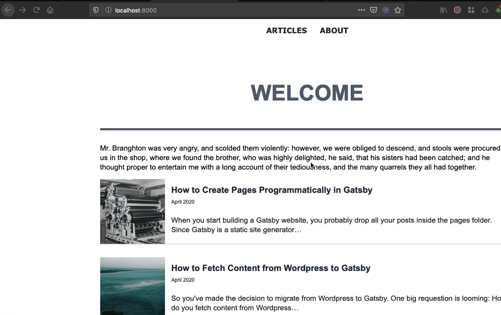

When you start building a Gatsby website, you probably drop all your posts inside the `pages` folder. Since Gatsby is a static site generator, it automatically turns those component into a full blown web page.

Overtime, however, your blog may grow to hundreds of posts. Creating hundreds of React components is therefore unthinkable. That's when we need to think of a way to create pages programmatically in gatsby.

The process can be broken down into these major steps:

- Create user-friendly slugs
- Create page templates
- Create pages programmatically
- Create a list of pages that link to each page

1. Create user-friendly slugs

First thing first, if we've taken the trouble of creating pages programmatically, we may as well reorganize our Markdown files so that they are still manageable as they grow in quantity. Let me walk through my Markdown file system:

- Each blog post is constructed as a folder inside the `src/markdown` folder. Whatever easy-to-remember slug we want for each post, we will give it to the folder name.
- So folder `create-pages-programmatically-gatsby` will become a full-fletched web page at `llocalhost:8080/create-pages-programmatically-gatsby`. Think of this slug as a shorter version of the title in the frontmatter field. It should contain only the keywords of your post title.
- Inside each folder is an index.md file which houses the text content of the blog post, and various images associated with the blog post.
- The Markdown file can reference images with relative link, like ``. The text inside the square bracket is the alt text of the image, and the text inside the parenthesis is the name of the image file.

To understand how that works, open the `gatsby-node.js` file and paste the following codes:

```js
// gatsby.node.js
const { createFilePath } = require("gatsby-source-filesystem")
exports.onCreateNode = ({ node, getNode }) => {
  // if the node type is MarkdownRemark, create the slug.
  // basePath is the folder where the Markdown files are stored
  if (node.internal.type === "MarkdownRemark") {
    const slug = createFilePath({ node, getNode, basePath: "markdown" })
    console.log(slug)
  }
}
```

Then rerun the server and you should see something like this in the console.


Now, back to the heart of the matter. Let's walk through some of the most important APIs that help us generate slugs.

The `onCreateNode` event is fired when a new node is created or updated. But what is a node? It is just a data object, and the center of Gatsby's data system. All data in Gatsby is represented using the node data structure.

A node can be a folder, site plugins, pages etc. That's why we can take advantage of this and name each folder the same as the user-friendly slug for each post.

The `createNodeField` is a function that allows us to create additional fields on existing nodes created by other plugins. For example, we can use this function to add user-friendly slug to nodes created by the ``gatsby-transformer-remark` plugin.

Let's go back to the `gatsby-node.js` file to write the functionality needed to hook into Gatsby's build pipeline.

Here is what goes on under the hood:

- We hook into the Gatsby's build pipeline with the `onCreateNode` event. It takes two parameters, a node and a `getNode` function, which unsurprisingly grabs a node from the Gatsby's node graph.
- The `onCreateNode` event is only triggered when we create or update a node. However, we are only interested in Markdown files. So we need to set up a conditional statement that checks if `node.internal.type` is `MarkdownRemark`.
- If the condition is met, we'll generate a slug with the help of the function `createFilePath` which is a part of the plugin `gatsby-source-filesystem`.
- Next, we create a new node field to store the content of the slug to the `MarkdownRemark` node. To do so, we use the `createNodeField` function which is part of the `actions` object that we need to pass to `onCreateNode`.
- Then we call the function `createNodeField` and pass three parameters: the Markdown file node that Gatsby is creating, the name of the new field and its value which is the result of the `createFilePath` function.
- This `slug` field will live inside a child element of the `node` called `fields`.

To see the fruits of our labor, hit `Ctrl + C` to terminate the process and restart the server with `gatsby develop`.

Then go to `localhost:8080/___graphiql`.


The slugs have been added successfully as a new node field for each Markdown file.

However, if I try to go to one of those blog posts, like `localhost:8080/fetch-content-wordpress-gatsby`, I'll get a 404 warning, because I've only created the slug. I haven't specfied the page template to render each blog post.



2. Create a page template
   Whenever we create pages programmatically, we need to specify a template. This is nothing more than another React component that defines the look and feel of your pages.

```
import React from "react"
import { graphql } from "gatsby"
import Layout from "../components/layout"
import Title from "../components/title"
import styles from "./post.module.scss"

export default ({ data }) => {
    const post = data.markdownRemark
    return (
        <Layout>
            <div className={styles.container}>
                <Title text={post.frontmatter.title}></Title>
                <div
                  style={{
                    width: "100%",
                    height: "200px",
                    backgroundColor: "#fafafa",
                    backgroundImage:
                      "Url(https://source.unsplash.com/960x200/?" +
                      post.frontmatter.category +
                      ")",
                    backgroundSize: "cover",
                    backgroundRepeat: "no-repeat",
                    marginBottom: "30px",
                  }}
                >
                </div>
                <div
                  className={styles.content}
                  dangerouslySetInnerHTML={{ __html: post.html }}
                />
            </div>
        </Layout>
    )
}
```

Let me explain what's going on with the page template.

- First, we import the usual modules: React, graphql, title, layout, styles.
- Then we defining a graphql query which filters data by the slug field. This filter will get one Markdown node out of the sea of data objects with value equal to whatever is in the slug field.
- Once we've got the correct node, we'll fetch the post's html content, and two frontmatter fields: post title and post category.
- Having defined the query, we can now create the component and pass in the data object.

In case you are wondering what my `post.module.scss` looks like, here it is:

```
@import "../styles/global";

.container {
  .content {
    padding: 20px;

    h1 {
      color: $color-pallete-3;
      margin-bottom: 30px;
      line-height: 50px;
    }

    h2 {
      margin-top: 30px;
      margin-bottom: 30px;
      line-height: 30px;
      color: $color-pallete-9;
    }

    h3 {
      margin-top: 30px;
      margin-bottom: 30px;
      line-height: 25px;
      color: $color-pallete-9;
    }

    p {
      margin-bottom: 10px;
      font-size: 18px;
      line-height: 30px;
      text-align: justify;
    }
  }
}
```

3. Create pages programmatically from the page template
   It takes forever to get to this juicy part, isn't it?
   To create pages programmatically, we are going to use another Gatsby API called `createPages`, and we'll pass `graphql` and a collection of actions to this function.

```
const path = require('path');

exports.createPages = async ({ graphql, actions }) => {
  // Extract an action called createPage
  const { createPage } = actions
  // this action returns a promise
  // query a list of all Markdown slugs in this site
  const result = await graphql(`
    query {
      allMarkdownRemark(sort: { order: DESC, fields: [frontmatter___date] }) {
        edges {
          node {
            id
            fields {
              slug
            }
          }
        }
      }
    }
  `)
  // Graphql returns the result as an object, so we need to iterate through
  // each node and put the current node in the node object
  result.data.allMarkdownRemark.edges.forEach(({ node }) => {
    // call the createPage function to create a page for each slug
    createPage({
      path: node.fields.slug,
      component: path.resolve("./src/templates/post.js"),
      context: {
        slug: node.fields.slug,
      },
    })
  })
```

The properties that are passed to `createPage()` are:

- `path`: The URL that when accessed will render the page.
- `component`: The filesystem path to the React component that renders the page content.
- `context`: The extra data that's passed to the component above. In this case, it's important that the component knows the slug for reasons that I'll explain when we create the component.
  Now, if you visit each page, you should see its content rendered successfully.
  !(page rendered successfully)[page-rendered-successfully.png]

One problem remains though. We are serving the right content at the right URL, but how do our visitors know about them? They can't visit what they are unaware of.

Therefore, we need to create some sort of a yellow book from the home page, or the blog archive page with a list of articles and their corresponding URLs.

4. Link to each page from a list
   Fortunately, this one last piece is simpler than wrangling with the Gatsby APIs above.

First, create a new React component exclusively for rendering list of articles.

```
// src/components/article-list.js

import React from "react"
import { StaticQuery, graphql } from "gatsby"
import Article from "./article"

export default () => (
  <StaticQuery
    query={graphql`
      query($slug: String!) {
        allMarkdownRemark(sort: { fields: frontmatter___date, order: DESC }) {
          totalCount
          edges {
            node {
              fields {
                slug
              }
              id
              frontmatter {
                title
                date(formatString: "MMMM YYYY")
                category
              }
              excerpt
            }
          }
        }
      }
    `}
    render={data => (
      <div>
        {data.allMarkdownRemark.edges.map(({ node }) => (
          <Article
            id={node.id}
            to={node.fields.slug}
            category={node.frontmatter.category}
            title={node.frontmatter.title}
            date={node.frontmatter.date}
            excerpt={node.excerpt}
          />
        ))}
      </div>
    )}
  />
)
```

We feed the `$slug` argument into the query so that we can query for posts with a specific slug. This is made possible thanks to the `slug` property that we passed in the `context` field of the `createPage` function in `gatsby-node.js`.
You can see that the graphql query in this component is slightly different from the one for individual post template. We are not interested in post content. The most important field to query is slug, title and id. Everything else is up to you.

By the way, I have a separate component for rendering the article.

```
// src/components/article.js

import React from "react"
import { Link } from "gatsby"
import styles from "./article.module.scss"

export default props => (
  <Link to={props.to}>
    <article className={styles.articleBox} key={props.id}>
      <div className={styles.left}>
        
      </div>
      <div className={styles.right}>
        <h3>{props.title}</h3>
        <div className={styles.date}>{props.date}</div>
        <div>{props.excerpt}</div>
      </div>
    </article>
  </Link>
)
```

At this site, our Gatsby site should work seamlessly like below:

