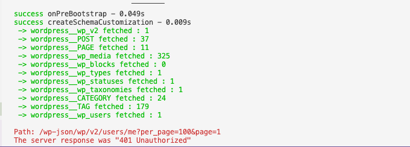
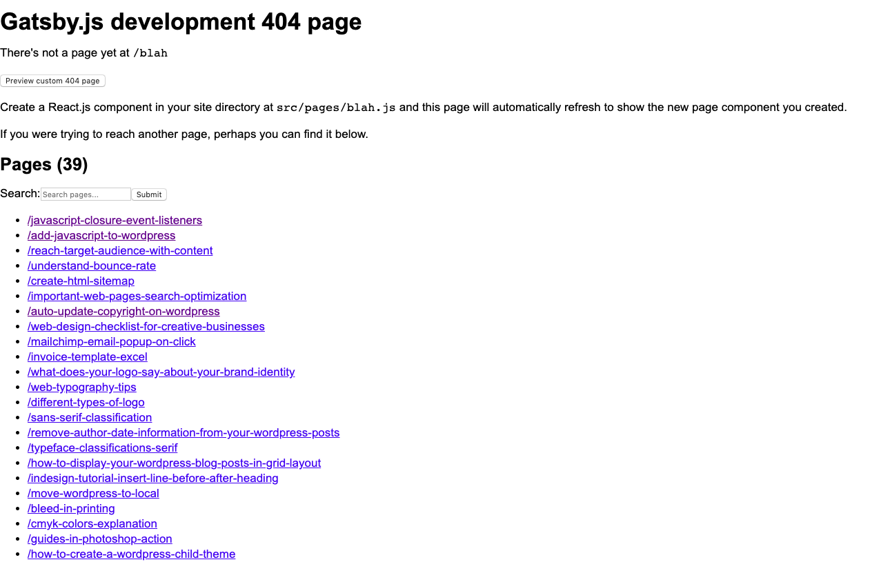
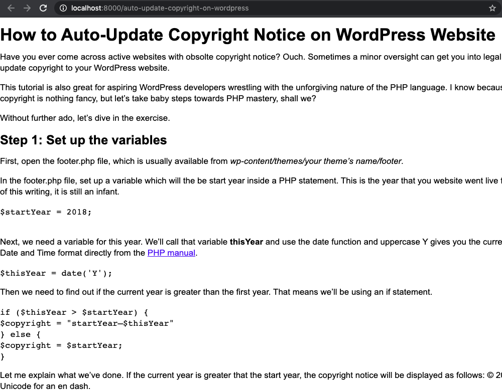

So you've made the decision to migrate from Wordpress to Gatsby. One big requestion is looming: How do you fetch content from Wordpress safely?

Luckily, sourcing data from Wordpress is easier than I thought, and it's quite hard to do it unsafely.

In a nutshell, you pull content from a Wordpress site through an API, and you either succeed or fail. You data will never be lost.

Now, let's dive into the actual process.

1. Install the `gatsby-source-wordpress` plugin with the following command:

```shell
npm install --save gatsby-source-wordpress
```

2. Next, we need to configure the plugin the pull data from Wordpress. Modify the `gatsby-config.js` as followed:

```js
module.exports = {
  plugins: [
    "gatsby-plugin-sass",
    {
      resolve: `gatsby-source-wordpress`,
      options: {
        baseUrl: `ihatewp.local`,
        protocol: `http`,
        hostingWPCOM: false,
        useACF: false,
      },
    },
  ],
}
```

The `gatsby-source-wordpress` can fetch data from both locally installed Wordpress and live sites. The only reason that I'm grabbing content from a local install is because my Wordpress has expired a long time ago.

3. After saving the `gatsby.config.js`, you can run `gatsby develop` and the plugin will pull content from the Wordpress site to your Gastby file system.



You should see something like this in your console. I got 401 unauthorized notifcation for some parts of my Wordpress site, like the user profiles, comment sections etc but I don't need them anyway.

4. Your data has been fetched, but you won't see them on the frontend because you haven't created pages from those content.

To do that, we need to query the Wordpress content, and construct a page for each in the `gatsby-node.js` file.

```js
const path = require("path")
const { slash } = require("gatsby-core-utils")

exports.createPages = async ({ graphql, actions }) => {
  const { createPage } = actions
  // query content for Wordpress posts
  const result = await graphql(`
    query {
      allWordpressPost(filter: { format: { eq: "standard" } }) {
        edges {
          node {
            id
            slug
          }
        }
      }
    }
  `)
  const postTemplate = path.resolve(`./src/templates/post.js`)
  result.data.allWordpressPost.edges.forEach(edge => {
    createPage({
      // `path` will be the url for the page
      path: edge.node.slug,
      // specify the component template of your choice
      component: slash(postTemplate),
      // In the template GraphQL query, 'id' will be available
      // as a GraphQL variable to query for this posts' data
      context: {
        id: edge.node.id,
      },
    })
  })
}
```

The very nice thing about GraphQL is that unlike REST API, you can query only what you need. In the example above, I'm only querying Wordpress posts with a “standard” format.

Now, restart the Gatsby server, and open a page that doesn't exist in your file system, like `localhost:8080/blah`.



You should get a predictable 404 error like me, but do you see a list of all the pages avaiable on your Gatsby site? We are heading in the right direction.

If you click on any of those links, you will see a blank page, because we haven't specified a template for each Wordresspost yet.

5. Create a template component for Wordpress posts at `src/templates/post.js` and add the following code:

```js
import React, { Component } from "react"
import { graphql } from "gatsby"
import PropTypes from "prop-types"

class Post extends Component {
  render() {
    const post = this.props.data.wordpressPost
    return (
      <>
        <h1>{post.title}</h1>
        <div dangerouslySetInnerHTML={{ __html: post.content }} />
      </>
    )
  }
}
Post.propTypes = {
  data: PropTypes.object.isRequired,
  edges: PropTypes.array,
}
export default Post
export const pageQuery = graphql`
  query($id: String!) {
    wordpressPost(id: { eq: $id }) {
      title
      content
    }
  }
`
```

I put the template inside the `src/template` folder because that's what I had specified in the `gatsby-node.js`. You can place it in anywhere you like, just make sure that you get the path right.

Restart the server, and you should see the corresponding content rendered beautifully for each post.


