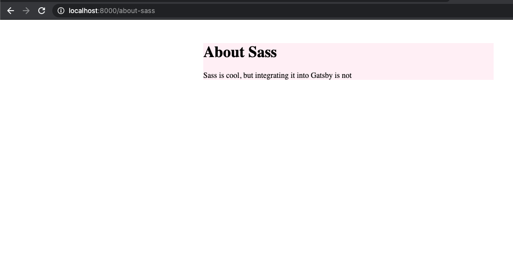
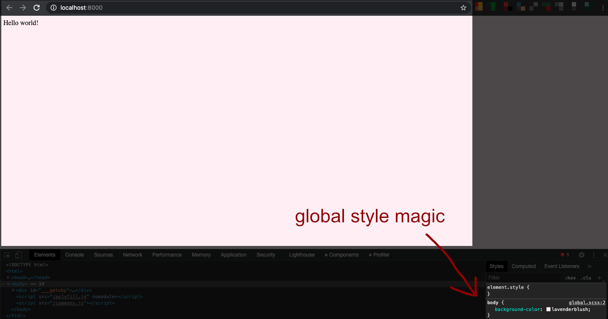
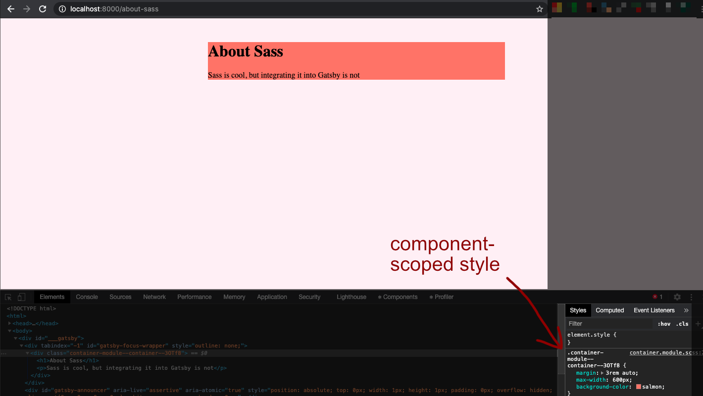

Adding global styles to a Gatsby site is a piece of cake.

Using CSS modules with Gatsby is painless.

Integrating Sass with Gatsby is also a snap.

However, what if you want to use a combination of global styling, Sass framework, and CSS modules? There is more to it than simply following a recipe for each method, mix them together, and get the shiny site on the other side.

That's the raison d'être for this article. But first, what's the deal with the amalgam of global styling, CSS modules and Sass?

I think no matter what CSS practices you adopt, you're not going to get away with global styling. It means that you only need to update one or two files when you need to make a site-wide change, instead of 100 pages.

CSS modules are not a must, but once you've adopted them you'll be really glad about it. How do you feel when you can write CSS like you normally do without having to rack you brain over which unique class names to dozens of comparable elements?

Last but not least, Sass may come in handy when your site grows big enough that writing CSS becomes too painful. That's a problem that I would love to have, and so I enlist the help of Sass.

## Set up a demo

In the terminal, navigate to the parent directory where you want to store your project files. Create a new site based on the Hello World starter theme.

```bash
gatsby new sass-integration https://github.com/gatsbyjs/gatsby-starter-hello-world
```

This will create a new folder named `sass-integration` inside the current directory.

Navigate to the `sass-integration` folder. If you have installed Visual Studio code , run `code .` to open this folder in this text editor.

## Use component-scoped CSS

Luckily, Gatsby works out of the box with CSS Modules because it was built by kind folks before us who got enough with class name collision.

First, create a new directory called `components` at the root of your project. Inside it, create a new `Container` component and import a CSS module.

```jsx
// src/components/container.js
import React from "react"
import containerStyles from "./container.module.scss"

export default function Container({ children }) {
  return <div className={containerStyles.container}>{children}</div>
}
```

You'll notice that the CSS module file shares the same name as the component file, and has an extension of `.module.scss`. That's how we tell Gatsby that we want to use component-scoped CSS.

And in case you are wondering if the `.scss` extension is a typo, it's not. You can absolutely use Sass/SCSS files as modules too.

In the next step, we are going to install some extra plugins to compile the into CSS. At run time, what Gatsby gets is CSS files, not SCSS so it should work correctly.

Next, create an SCSS module at `src/components/container.module.scss`. It doesn't have to be in the same directory as the Container component, but this makes it easier to get hold of your site architecture.

```sass
// src/components/container.module.scss
.container {
	margin: 3rem auto;
	max-width: 600px;
}
```

## Integrate Sass with Gatsby

We've created a Sass file in the previous step, but notice that there is nothing Sass about it. The file just contains pure CSS syntax. That's because we haven't installed plugins that will help compile Sass into CSS for us. Without them, our website will fail because the browser can't read Sass.

Install `gatsby-plugin-sass`, the official Sass compiler for Gatsby and `node-sass`.

```bash
npm i gatsby-plugin-sass node-sass
```

Then install `sass` as a development dependency. The reason why it is not a production dependency is because it is only needed for `gatsby-plugin-sass` to interpret Sass. It will make no presence in production.

```bash
npm i -D sass
```

In the `gastby-config.js` file, set up the configurations for `gatsby-plugin-sass` as followed:

```jsx
module.exports = {
  /* Your site config here */
  plugins: [
    {
      resolve: "gatsby-plugin-sass",
      options: {
        implementation: require("sass"),
        data: `@use "src/styles/variables" as var;`,
      },
    },
  ],
}
```

By default, `gatsby-plugin-sass` uses the node implementation of Sass (`node-sass`). The module works fine, except that it doesn't support loading built-in Sass modules with `@use` rule, and we are going to use that in our Sass file later on.

In Sass, the `@use` rule is used to load other Sass stylesheets. You can use `@import` in its stead, just like in CSS. However, the `@import` rule is heading towards its end in the next few years and even the Sass team warn against using it.

From my experience, it's always worth spending a little bit more time to make sure that your site is still running strong with no deprecation warning after a few years.

That aside, what does the `data` option do? It will pass the `@use` rule into every SCSS file, and at the same time it namespace the `variables` module as just `var`.

For example, you have a Sass file that defines all the global variables like font family, site width, font color, background color etc.

You are going to load them in all the stylesheets to ensure design consistency. But who wants to remember write `@use "src/styles/variables` in dozens of stylesheets?

With the `data` configuration in Gatsby config, now you don't have to write that `@use` rule over and over again. You only have to write the namespace to load variables, functions and mixins from the `variables` module.

If that doesn't make sense, don't worry. Create a new stylesheet at `src/styles/_variables.scss`.

Please note that there is an underscore in front of the file name. That tells the Sass engine that this `_variables.scss` file is meant to be loaded as modules. It won't be generated into CSS unless you import it into another Sass file as partial. Any file loaded using the `@use` rule is called a partial.

When loading it with the `@use` rule, you can leave out the underscore.

Add style to this `_variables` module:

```sass
// src/styles/_variables.scss
$bgcolor: lavenderblush;
```

Then modify the Container CSS module to use the `$bgcolor` variable above:

```sass
// src/components/container.module.scss
.container {
  margin: 3rem auto;
  max-width: 600px;
  background-color: var.$bgcolor;
}
```

## Render Sass in Gatsby

We've technically integrated into Gatsby, but how can we tell if it works or not?

Create a new file named `about-sass.js` under `src/pages` directory. In this file, import and render the Container component like below:

```jsx
import React from "react"
import Container from "../components/container"

export default function About() {
  return (
    <Container>
      <h1>About Sass</h1>
      <p>Sass is cool, but integrating it into Gatsby is not</p>
    </Container>
  )
}
```

Now, run the command `gatsby-develop` and go to `[localhost:8000/about-sass](http://localhost:8000/about-sass)` and you should see Sass being applied safe and sound.



Global variables should be defined outside any rules. It's a good practice to define all global variables in its own file, named `_global.scss`, and include the file with `@rule` keyword.

## But we haven't added global styles

That's right. Our about page above may be a special snowflake, but not that special. It should still adhere to certain site-wide styles to ensure a consistent brand identity.

To enforce a global style, create a new file `gatsby-browser.js` at the root of your directory. The name `gatsby-browser` is important, because it tells Gatsby that we want to implement Gatsby browser APIs and interact with the client-rendering of Gatsby.

Create a new stylesheet `src/styles/global.scss` and import it into the `gatsby-browser.js`.

```jsx
// gatsby-browser.js
import "./src/styles/global.scss"
```

Inside the global stylesheet, specify the background color property for the body element:

```sass
body {
	background-color: var.$bgcolor;
}
```

Then comment out the background color in the Container CSS module.

Restart the server and you should see the lavender blush color applied on the index page as below.



But I think our about page still deserves to stand out like the original plan.

In the `_variables.scss`, and a new variable:

```sass
// _variables.scss
$attention: salmon;
```

After that, add back the background color property for the Container CSS module.

```sass
// container.module.scss
.container {
	margin: 3rem auto;
	max-width: 600px;
	background-color: var.$attention;
}
```

Switch back to your Gatsby website and navigate to the about page to see the little magic.


