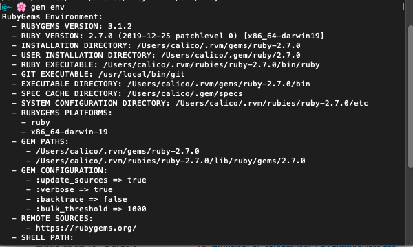

Running an app in a programming language already installed on a Mac should be easy, right? Since the language has been preinstalled and configured, all you need is to download the app and run.

That's what I thought, until I face planted at the very first step: installation.

Here's the dreadful message I got when I tried to run the command `gem install twurl`

> You don't have write permissions for the /Library/Ruby/Gems/2.6.0 directory.

Here, Gem is a package manager for the Ruby language. It allows you to download, install and use Ruby software packages on your system. Think of Gem as Ruby's answer to NPM for Node.js.

At the time, I didn't know that the default Ruby version on Mac wasn't meant for users like me to play around. MacOS bundles it for its own use and won't let you change anything with the Ruby version that comes installed with your Mac.

Hence you need to install a separate version of Ruby that doesn't interfere with the one provided by Apple.

However, **don't** follow the simplest instruction you can find, as you'll probably regret it later on.

The simplest instruction for installing a new version of Ruby on a Mac goes something like this:

- Install Ruby with `brew install ruby`
- Run `vi ~/.bash_profile`to open your Bash settings
- Add the following line to the file: `echo 'export PATH="/usr/local/opt/ruby/bin:$PATH"' >> ~/.bash_profile` to update your `PATH` . This will tell Mac to use the Ruby version installed at `/usr/local/opt/ruby` instead of the default `/Library/Ruby`.
- Run `source ~/.bash_profile` to commit the change.
- Restart the terminal and voila.

Why is it a problem?

If you try installing twurl again with `gem install twurl`, you're very likely to get hit with another abominable error message:

> ERROR: While executing gem ... (Errno::EACCES) Permission denied @ rb_sysopen

You have changed the path for the executable Ruby to `/usr/local/opt/ruby`, but in the end it's still a restricted path owned by `root` and can only be written to by prefixing the command with `sudo`.

That's an easy way out, but I don't recommend it since you'll lose track of how paths and permissions work. If you have to elevate the system permissions just to install a Ruby package, then there must be a safer way.

To save your hairs, please follow this sequence of steps that I have personally tested to work beautifully.

Since you are here for Ruby and Gems, I assume that you have installed Homebrew, the software package management  for MacOS operating system.

Whoever thought that the mere installation of a new language on a Mac could be so cumbersome?

## Install RVM

RVM allows you to install and manage multiple installations of Ruby on your system. There are many advantages to use RVM instead of installing Ruby manually:

- The Rubies you install will be in your home directory. You'll be able to install Ruby packages without permission issues.
- You can switch between many Ruby versions.
- Installation time is no longer than doing it manually and figuring out the missing parts along the way.

Simply follow the installation guide at RVM's home page as it couldn't be more straightforward.

In case you need a recap:

- Install GPG keys. GPG key is a method used for digital signatures and encrypting/decrypting stuffs. For example, you use GPG key to sign your commits on your Github account.
- Install RVM with `curl`

## Install Ruby with RVM

To check which ruby you are using, run this command `which ruby`. If you get an output that is `/usr/bin/ruby`, that means you are using the outdated Ruby preinstalled on Mac.

 We can use rvm to install Ruby into our home directory

To install the latest versions of Ruby, run `rvm install ruby`

## Install a gem

Gem is always automatically installed into the new Ruby.

You can check the gem environemnt settings with `gem env`

Now, you can install any Ruby package with the command `gem install [name of the package]`.

After finishing the installation, you can check where a particular gem is installed with`gem which`. 

For example, when I run `gem which twurl`, I get the following output:

`home-directory/.rvm/gems/ruby-2.7.0/gems/twurl-0.9.5/lib/twurl.rb`