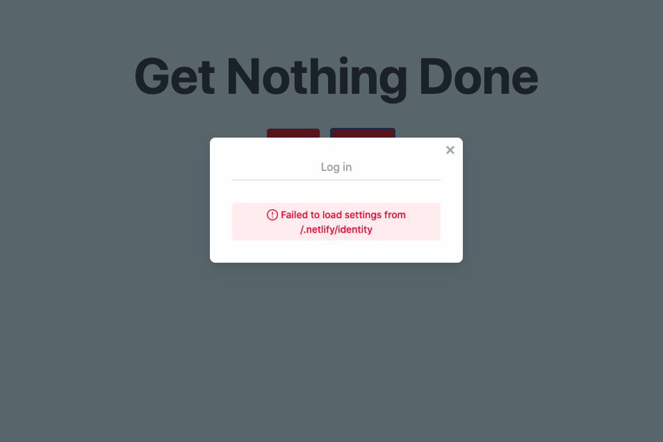
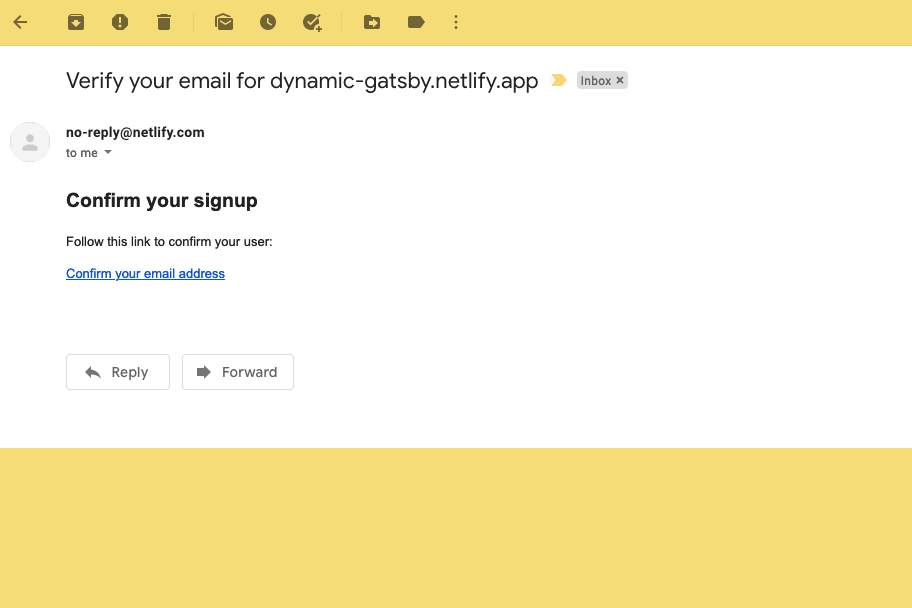
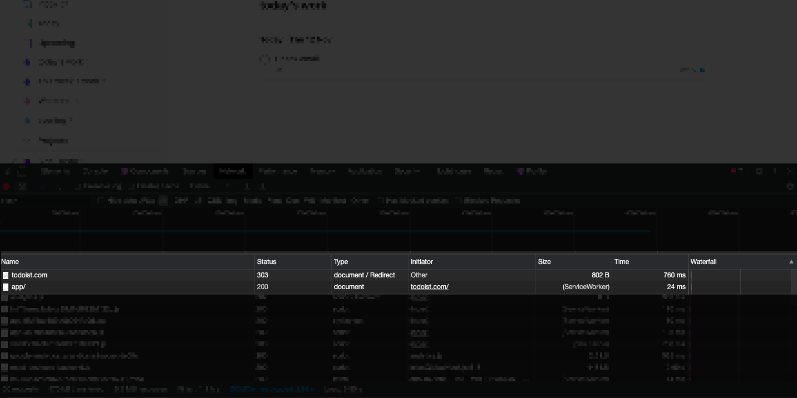
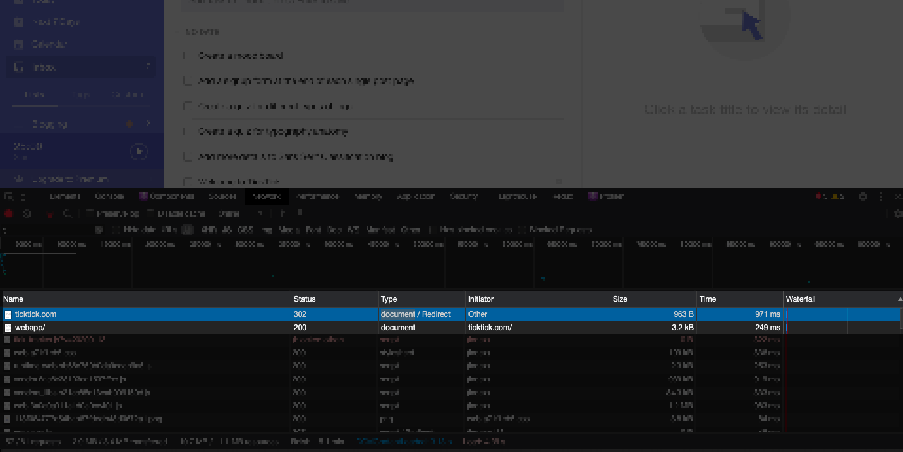
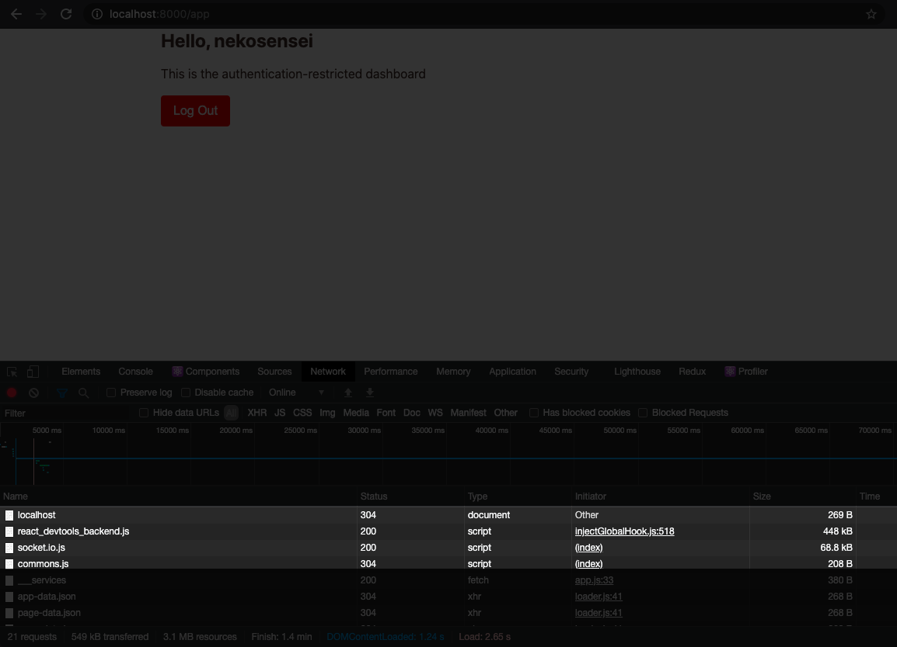

import clientRedirectFlow from './client-side-redirect-outcome.gif'

So your website is running happily with Gatsby. However, like every digital product, it is bound to grow and evolve. One candidate for change that you probably don't give much thought to is URL architecture.

A blog post that started out at a URL like `http://yourdomain.com/website-speed` may be redirected to `http://yourdomain.com/blog/how-to-make-your-website-faster`.

Another scenario that you may find yourself in is when your content attracts a large following, prompting you to offer a gated section for subscribers.

Once they land on your home page, they will be automatically taken to a private dashboard page. Meanwhile, unauthenticated users who land on that private route will be navigated to the home page with a log-in section. This is a very common design pattern in web apps.

How do we put that into implementation? Stick with me and by the end of this post you'll build a production-ready redirect workflow that you can plug into any Gatsby app you dream up.

## Set up and deploy a new site

Click this [link](https://app.netlify.com/start/deploy?repository=https://github.com/bytrangle/gatsby-redirect) to set up a starter app. This will:

- Create a new Github repo on your account with the starter code.
- Create and deploy a new site with Netlify using your repo.

Once your starter site has been deployed, clone the new repo that you have created to your local machine.

```bash
git clone git@github.com:<YOUR_USERNAME>/gatsby-redirect.git
```

Replace `gatsby-redirect` with any name you set for your repo when you deploy with Netlify.

Then move into the new folder and install all the necessary dependencies.

```bash
cd gatsby-redirect
npm install
```

Open `gatsby-redirect` in your favorite code editor.

## Enable Netlify Identity

Authentication is the very reason why redirect is needed in our case, and we are going to use Netlify Identity service for that purpose.

Visit your Netlify dashboard and navigate to the site you've just deployed. Click the “Identity” tab and click the “Enable Identity” button.

Otherwise, when you click on the “Sign up” button in the live site, you will get this spooky error like below.



After enabling Netlify Identity, go back to the terminal and start the development site.

```bash
gatsby develop
```

Go to `[localhost:8000](http://localhost:8000)` and click the “Sign up” button. Netlify will automatically detect that we're running on a local server. Paste in the URL of your production site and click the “Set site's URL” button.

The Netlify signup modal will load up again. Sign up as usual, and check your email for a confirmation email from Netlify that looks similar to this.



Click on the confirmation link and you'll be directed to your production site. Open your browser history and look for the URL with this pattern `your-domain.netlify.app/#confirmation_token=<TOKEN>`.

Copy the string starting from the hash to the end of the url and add it to your [localhost](http://localhost) site like this: `localhost:8000/#confirmation_token=<TOKEN>`.

Paste the string into the address bar and enter. That's how you confirm your account on the local server.

Don't worry if you get a daunting notification like “There was an error verifying your account". Switch back to your Netlify dashboard, go to the Identity tab. If you see your new account, that's all that matters.

## The lowdown on site redirection

All types of redirects can be divided into two groups:

- server-side: the server responds to the browser's request with a 30x status code
- client-side: the browser itself makes the redirect (can be done with HTML or Javascript)

Traditionally, every time you try to access a certain URL, your browser sends a GET request to the server. The server replies with a certain status code which is a three-digit number. A status code can represent a successful response as well as an error.

That process is known as server-side rendering. To server-side redirect, you make a deal with the server that whenever visitors go to pages with a certain pattern, send them to a different URL without changing content. For example, every visit to `[gatsbyjs.org](http://gatsbyjs.org)` is now redirected to `gatsbyjs.com`.

There are many ways to configure server-side redirection depending on your web server. Luckily, our site is deployed to Netlify, so we can simply install the official Netlify plugin for Gatsby and add a few line of codes in `gatsby-config.js` for redirection.

Notice that I used the word “traditionally” because nowadays, not every URL visit constitutes a request to the server. Many web apps use client-side routing, which means that visitors can go to different links within the app without firing any request to the server.

There are dedicated libraries for client-side redirection, but for our purpose in this tutorial, we will use the `navigate` helper function provider by the `gatsby` package. It is a wrapper for `window.location`.

Whether you like to call it client-side rendering or client-side routing, the goal is the same: to make a web app fast and snappy just like a desktop app.

## How to tell server-side redirect from client-side?

Server-side redirect by default is faster than client-side because it is an explicit instruct by your server, and it doesn't have to wait for Javascript to load.

But that probably doesn't mean much when you have no clue what is fast or not.

Here is the most reliable way I can think of:

- open a new browser tab
- Open your browser developer tool and click the Network tab.
- Hit the Clear icon to make sure that the Network tab is in a clean state.
- Visit a web app that you have logged in with and which redirects a logged-in user from the home page to a restricted page. The two apps that I know are Todoist and Ticktick.
- Look at the Network tab. If you see the first network request from the homepage, e.g. [todoist.com](http://todoist.com) with a 30X status code of type “Document/Redirect”,, followed by a request to the private route todoist.com/app, it is almost certainly server-side redirect.





On the other hand, my demo Gatsby app uses client-side redirect, so you only see the request from `localhost`, and not `localhost:8000/app`. A redirect by Javascript doesn't trigger a request to the server.



With that said, when should you use which?

Usually, client-side rendering is for intra-site linking, when you link to other pages within your site. Also, when you navigate via client-side rendering, you avoid making a request to the server. Your users won't see a flash in the browser and overall your app will look snappier.

On the other hand, server-side redirects take care of inter-site linking: other sites navigating to your site on a broken link. You have no control over Javascript of other websites, and doing it from the server is the only way to go.

Overall, redirect is not an either-or situation. You should do both server and client side for optimal user experience. The method to set up server-side redirect vary between hosting providers, so in this tutorial, we'll focus on client-side redirect.

## Redirect via the client side

Now that we are able to log in, we can add some logic to redirect users whenever Netlify Identity returns a valid user.

Authentication is beyond the scope of this tutorial. If you want to to learn how to implement a plug-and-play authentication service in a static site built with Gatsby, please look forward to my next tutorial.

To cut a long story short, we wrapped our entire Gatsby app inside a mother component that passes the user information, Netlify Identity object and login completion status (true or false) to any child that is willing to hear back from her.

The two children are the LandingPage component inside `src/pages/index.js` and App component exported by `src/pages/app.js`.

This user context contains two values, an user object retrieved when we initialized the Netlify Identity widget, and `netlifyIdentity` object. The user object returns null when user is not logged in, and an object with key-value pairs like id, JWT, email, full name etc.

```jsx
// src/pages/index.js
import React, { useContext, useEffect } from "react"
import { UserContext } from "../utils/Identity"
import Public from "../components/Public"

const LandingPage = () => {
  const { user, identity } = useContext(UserContext)
  return <Public identity={identity} />
}

export default LandingPage
```

On theory, client-side redirect is quite straightforward. In the `LandingPage` component, you check if user is defined, then navigate using the built-in function from Gatsby. Otherwise, render the public information which includes a form for signing in or signing up.

```jsx
// src/pages/index.js
import React, { useContext, useEffect } from "react"
import { navigate } from "gatsby"
import { UserContext } from "../utils/Identity"
import Public from "../components/Public"

const LandingPage = () => {
  const { user, identity, loginComplete } = useContext(UserContext)
  console.log(user)
  if (user) {
    navigate("/app")
    return null
  }
  return <Public identity={identity} />
}

export default LandingPage
```

But there are two glaring problems with our approach:

First, if you run `gatsby build` now, you'll get a menacing error: “Window is not defined”. That's because the `navigate` method use `window.location` under the hood to redirect, and the `window` object is not available during server-side building.

To get around that, we'll use the `useEffect` hook from React to fire `navigate` only when the component is rendered.

```jsx
// src/pages/index.js
//...
console.log(user)
useEffect(() => {
  if (user) {
    navigate("/app")
  }
})
useEffect(() => {
  const timer = setTimeout(() => {
    if (loginComplete === false) {
      setDisplayElem("public")
    }
  }, 2000)
  return () => clearTimeout(timer)
}, [loginComplete])
if ((!user && loginComplete) || displayElem === "public")
  return <Public identity={identity} />
return <h1>Loading...</h1>
//...
```

Do the same thing for `app.js` file.

```jsx
import React, { useContext, useEffect, useState } from "react"
import { navigate } from "gatsby"
import { Container, Button, Heading } from "theme-ui"
import { UserContext } from "../utils/Identity"

const App = () => {
  const { user, identity: netlifyIdentity, loginComplete } = useContext(
    UserContext
  )
  console.log(user)
  console.log(`login state is ${loginComplete}`)
  useEffect(() => {
    if (!user && loginComplete) {
      navigate("/")
    }
  })
  useEffect(() => {
    const timer = setTimeout(() => {
      console.log(loginComplete)
      if (loginComplete === false) navigate("/")
    }, 2000)
    return () => clearTimeout(timer)
  }, [loginComplete])
  if (user)
    return (
      <Container>
        <Heading>Hello, {user?.user_metadata?.full_name}</Heading>
        <p>This is the authentication-restricted dashboard</p>
        <Button
          onClick={() => {
            netlifyIdentity.logout()
          }}
        >
          Log Out
        </Button>
      </Container>
    )
  return <h1>Loading...</h1>
}

export default App
```

The second problem with this approach is your user may not have Javascript enabled on their browser. This is not uncommon, especially if users are accessing your app from a company network with strict policy. That means we'll need to take care of server-side redirect as well.

Even if your users do have Javascript enabled, server-side redirect is still necessary because it will always be faster and take priority over client-side rendering.

## Client-side redirect is not enough

In the end, all that Gatsby generates are just HTML, CSS and Javascript files. It doesn't run any kind of server to respond to browser requests in production. Hence you can't address redirect using Gatsby alone.

Hit up your host documentation and check for the redirect section. If you use Netlify as your host, you may be interested in role-based access. Here's what goes on under the hood:

- You specify in a redirect document what and where to redirect when users have a certain role. For example, users with role of “user” visiting your home page will be redirect to the `/app` route.
- When someone visits your web app, the authentication service is initiated and it checks if there is a valid JSON web token with the “user“ role. Both conditions have to satisfy for the redirect to happen.
- If it is, the user will get directed to `/app` route, faster than she can even realize it.

I'd like to show you demo for it, but role-based access is a feature of the business plan, so have fun exploring Netlify.

As a wrap, here is the final client-side redirect workflow.


Do you have a better way to do client-side redirect with Gatsby? Please head to the comments to share your tricks of the trade.
