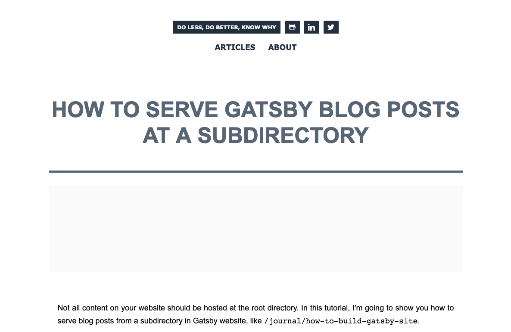
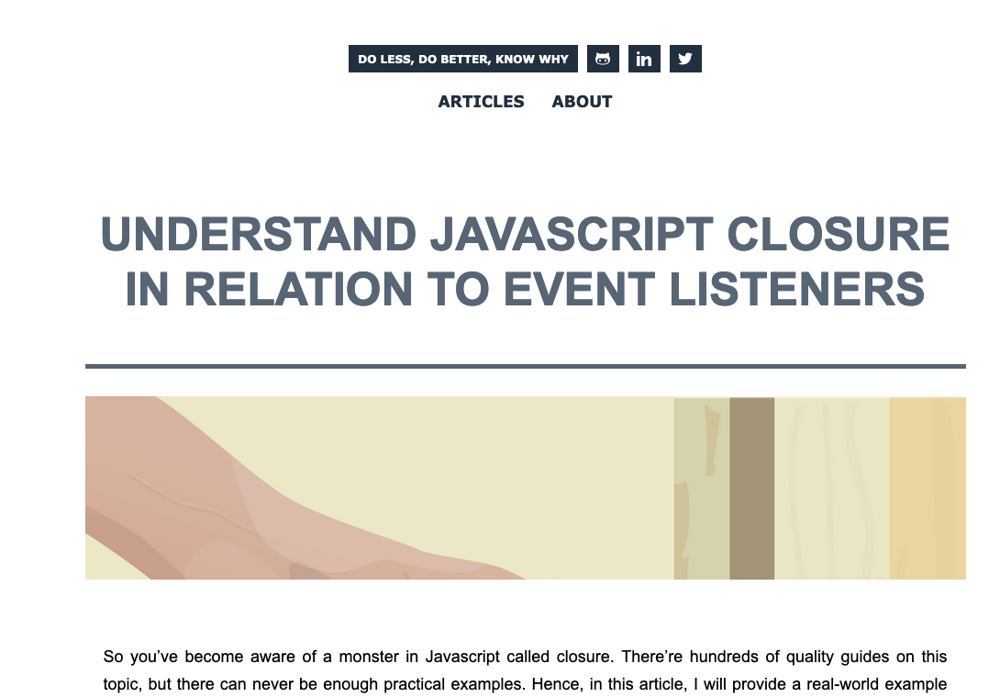

It is a lot of work to create pages for your blog post, but what if your content come from various places, like Wordpress, Contentful, Markdown, Mdx? In this tutorial, I'm going to show you how to render blog posts from multiple sources, using only one template.

So how does that work? The idea is that no matter where your blog posts come from, they should share the same aesthetics and layout. In other words, they are rendered by the same component, unless you have some content types that differ enough from the usual posts that warant a new template.

Within the scope of this tutorial, I assume that you already know how to create pages programmatically in Gatsby .

Let's get started. The whole process can be divided into three steps:

- specify the template for rendering blog posts in `gatsby-node.js`.
- query the relevant data inside the template
- render the data

1. Specify the template for rendering blog posts
   In the `gatsby-node.js` file, look for the API named `creaPages`, and configure the path to the template that you would use to render the blog posts.

```js
// ...
exports.createPages = async ({ graphql, actions }) => {
  // Extract an action called createPage
  const { createPage } = actions
  // this action returns a promise
  // query a list of all Markdown slugs in this site
  const result = await graphql(`
    query {
      allWordpressPost(filter: { format: { eq: "standard" } }) {
        edges {
          node {
            id
            slug
            fields {
              link
            }
          }
        }
      }
      allMarkdownRemark(sort: { order: DESC, fields: [frontmatter___date] }) {
        edges {
          node {
            id
            fields {
              link
              slug
            }
          }
        }
      }
    }
  `)
  const arr = [
    ...result.data.allMarkdownRemark.edges.map(e => e.node),
    ...result.data.allWordpressPost.edges.map(e => e.node),
  ]
  arr.forEach(el => {
    createPage({
      path: el.fields.link,
      component: path.resolve("./src/templates/post.js"),
      context: {
        id: el.id,
      },
    })
  })
}
```

There is not much difference from the usual programmatic creation of pages from data, except that I copy the `node` field of the `result` object to a new array. Then I loop through each item and create a page for it.

If you are wondering what's the use of the map function, that's because `result.data.allWordpressPost.edges` and `result.data.allMarkdownRemark.edges` are both arrays which contain the `node` key that we want to extract.

Why am I doing this? Because the Wordpress posts and the Markdown files are going to share the same template, and I just don't want to repete codes. In addition, Here is my original code:

```js
result.data.allMarkdownRemark.edges.forEach(({ node }) => {
  // call the createPage function to create a page for each slug
  createPage({
    path: node.fields.link,
    component: path.resolve("./src/templates/post.js"),
    context: {
      id: node.id,
    },
  })
})
result.data.allWordpressPost.edges.forEach(({ node }) => {
  createPage({
    // `path` will be the url for the page
    path: node.fields.link,
    // specify the component template of your choice
    component: path.resolve("./src/templates/post.js"),
    // In the template GraphQL query, 'id' will be available
    // as a GraphQL variable to query for this posts' data
    context: {
      id: node.id,
    },
  })
})
```

Your query may be different than mine, but the most important thing to remember is the `createPage` function and its parameters:

- `path` specifies the URL where your content will be rendered. For example, if you blog post is served at `yourwebsite.com/blog/hosting-in-the-cloud`, then the path is `/blog/hosting-in-the-cloud` which includes the leading slash. This means that you'll need to create a `path` field for each `node` object.
- `component` specifies the link to the React component that takes charge of rendering your content.
- `context` is optional. It's just the extra data that you want to pass to the template component above. I pass the node id because no post in my file system will share the same id.

Next, create a new file named `post.js` inside `src/templates` directory. Inside this file, we'll query data from all the sources that we want, and then render them.

```jsx
import React from "react"
import { graphql } from "gatsby"
import Layout from "../components/layout"
import Title from "../components/title"
import styles from "./post.module.scss"

export const query = graphql`
  query($id: String!) {
    markdownRemark(id: { eq: $id }) {
      html
      frontmatter {
        title
        category
      }
    }
    wordpressPost(id: { eq: $id }) {
      title
      featured_media {
        source_url
      }
      content
    }
  }
`
```

2. Query the relevant data inside the template

The first step was so long-winded, but this step is fortunately easier. You just have to query whatever piece of post data that you want. Titles, ids and content are must-haves, but you can also add date, categories, tags, featured media etc.

```jsx
export const query = graphql`
  query($id: String!) {
    markdownRemark(id: { eq: $id }) {
      html
      frontmatter {
        title
        category
      }
    }
    wordpressPost(id: { eq: $id }) {
      title
      featured_media {
        source_url
      }
      content
    }
  }
`
```

3. Render the data

This step is also an easy ride. Because `wordpressPost` and `markdownRemark` have different data structure, the most important part is to use ternary operator to separate them, and render the data that you want.

```jsx
export default ({ data }) => {
  const { markdownRemark, wordpressPost } = data
  return (
    <Layout>
      {wordpressPost && (
        <div className={styles.container}>
          <Title text={wordpressPost.title}></Title>
          <div
            style={{
              width: "100%",
              height: "200px",
              backgroundColor: "#fafafa",
              backgroundImage:
                "Url(" + wordpressPost.featured_media.source_url + ")",
              backgroundSize: "cover",
              backgroundRepat: "no-repat",
              marginBottom: "30px",
            }}
          ></div>
          <div
            className={styles.content}
            dangerouslySetInnerHTML={{ __html: wordpressPost.content }}
          />
        </div>
      )}
      {markdownRemark && (
        <div className={styles.container}>
          <Title text={markdownRemark.frontmatter.title}></Title>
          <div
            style={{
              width: "100%",
              height: "200px",
              backgroundColor: "#fafafa",
              backgroundImage:
                "Url(https://source.unsplash.com/960x200/?" +
                markdownRemark.frontmatter.category +
                ")",
              backgroundSize: "cover",
              backgroundRepeat: "no-repeat",
              marginBottom: "30px",
            }}
          ></div>
          <div
            className={styles.content}
            dangerouslySetInnerHTML={{ __html: markdownRemark.html }}
          />
        </div>
      )}
    </Layout>
  )
}
```

Here is blog posts rendered from a Markdown file, and a Wordpress post, respectively. I have issues with displaying random Unsplash images for my Markdown files, but other than that, both posts look the same, and that's what we are looking for.



