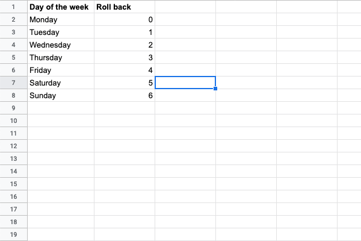

Some mundane activities look so harmless that you probably don't even think much about it, until you have to do it hundreds of time.

I'm talking about getting a start and end date of a given week number in Google Sheets.

Sure. You open an online calendar, click sevaral times to navigate to the relevant week number, and see the date of the Monday and Sunday. But how about repeating that innocuous sequence for hundreds of records?

And the pain adds up if the week number refers to several years ago, or you calendar settings don't include week numbering.

I'm going to show you a “better” way to get the start and end date quickly when we know the week number. I put “better” in double quotes because it took me a while to wrap my head around the logic of the formula. Once I've got the hang of it, however, there is no going back.

By the way, this formula works for both Excel and Google Sheets, so there's no reason not to learn it.

## Understand the basics of week numbering system

Because week is a human-made concept to make sense of time, spreadsheet programs like Excel and Google Sheetssoftwares have to pick a week numbering system named ISO.

In this system, week 1 contains the first Thursday of the year. Depending on the year, the first Thursday can come early or late.

The ealiest the Thursday can be is 1 January. On the other hand, if it comes late, it can't be later than 7 January, because if it falls on 8 January, then it is no longer the first Thursday o the year.

We know that Thursday is always three days after Monday, so the first Monday of the first week of the year is always between 29 December and 4 January.

Now that we've understood the ISO week numbering system, what's next? We'll need to:

- calculate the first Monday of the year.
- add that Monday to 7 \* week number to get the Monday of a given week number.
- add 6 to the Monday to get the end date of the week.

## Get the first Monday of the year

First, we need to find the Monday of the same week that a given date belongs to. There is a pattern for that.

For any random date, you need to deduct from it a specific number to get the Monday, depending on what day of the week the given date is. If the given date is Friday, we roll back by 4. If it is Sunday, we roll back by 6.

Incidentally, there is a numbering system in Google Sheets in which days of the week are assigned the same value as the roll back value above. It's type 3, which counts from Monday, and the value of Monday is 0, and Friday is 6. .

So, to get the Monday in the same week as a given date, we can use the following formula:
`=DATE - WEEKDAY(DATE, 3)`

From this generic formula, we can get more specific: get the the first Monday of the year.

We have already known that the first Monday of the year always is always between 29 December of last year and 4 January of this year. Hence we can figure out the Monday immediately before 5 January.

`=date(A2,1,5)-weekday(date(A1,1,5),3)`

In the formula above, A2 is the value of your chosen year. Suppose the year is 2020.

Let's try an example.
`=date(2020,1,5)-weekday(date(2020,1,5),3)`

The result we get is 30/12/2019. I guess this is the most convoluted part of the challenge. The Monday of first week of year 2020 falls on 30 December of last year.

## Get the last Monday of the previous year

We've got the first Monday of our chosen year, but what we are really interested in is very last Monday of previous year. Why is that?

Let's try out what happens if go with the first Monday of the year. Suppose the week number is 17, and add 7 \* 17 to the first Monday of 2020, we'll get 27 April. However, you can check for yourself that day is actually Monday of week 18.

To get the last Monday of the previous year, we just have to subtract 7 from 5 January, and it will become `date(A2,1,-2)`. The `date` function in Google Sheets can take negative value.

## Get the start date of any given week number

Things get easier from now on.
`=date(A2,1,-2)-weekday(A1,1,5),3)+7*B2`, in which B2 is the week number.

## Get the end date of any given week number

It takes miles to figure out the start date for a random week number, but getting the end date is easy peasy. We just have to add 6 to the start date.
`=date(A2,1,-2)-weekday(A1,1,5),3)+7*B2+6`
