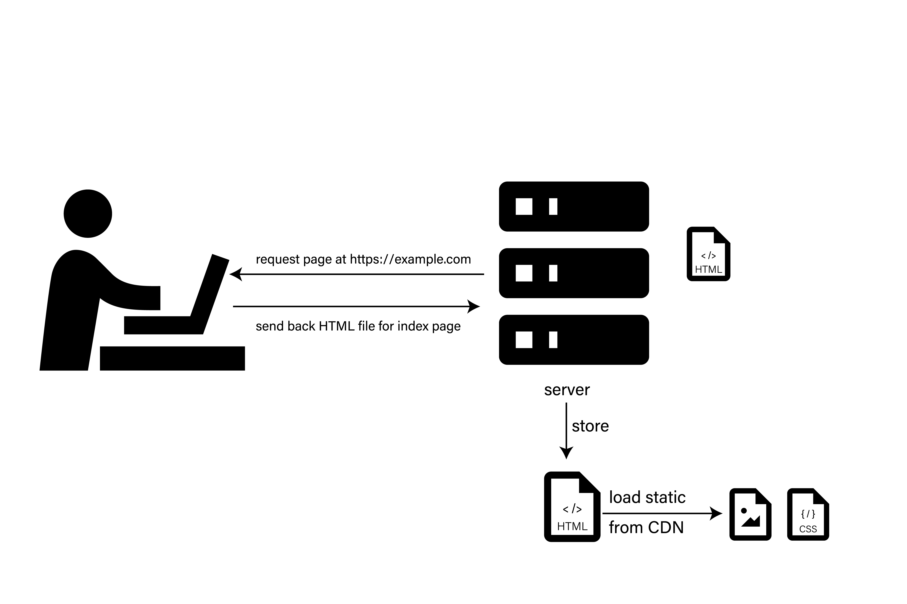
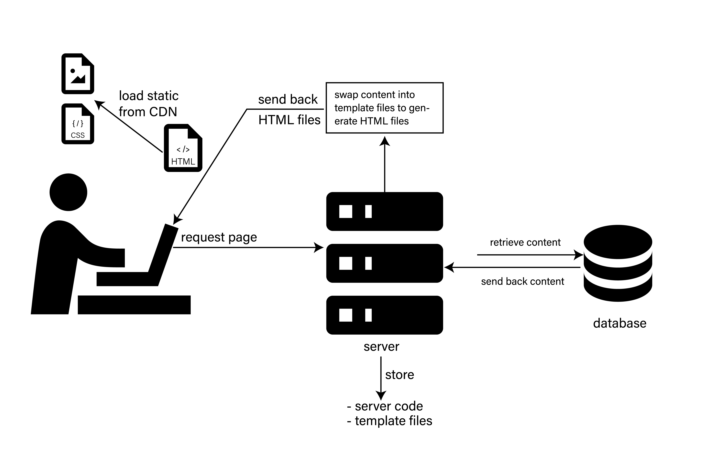

import CaptionedImage from "../../../src/components/CaptionedImage"

If you've been hearing people rave about static sites, and wonder if it would do you any good, this is the article for you.

A few weeks ago, I still had no clue what static site was, and it was frustrating because everyone seemed to get it, except me.

Embarrassingly, I have a static Gatsby site that I built from scratch months ago. I just couldn't understand what was static about my site.

It only contained blog content just like my retired Wordpress site, but why does no one call a Wordpress site static?

It wasn't until I got a chance to build a dynamic site with Node.js and EJS, a templating engine that I finally saw the daylight.

But first, let's talk about web server, because every website under the sun, static or dynamic, needs a server.

## What is a web server?

When you hear the term “server”, it can mean either the hardware, the software, or both.

On the hardware side, a web server is a specialized computer that stores web server software and a website's component files. It is much more powerful, and larger in size than the standard consumer computer.

<!-- ") -->

<!-- <figcaption>

</figcaption> -->

<CaptionedImage path="server.jpg" alt="test" caption='Photo by <a href="https://unsplash.com/@scienceinhd?utm_source=unsplash&utm_medium=referral&utm_content=creditCopyText">Science in HD</a> on <a href="https://unsplash.com/s/photos/server?utm_source=unsplash&utm_medium=referral&utm_content=creditCopyText">Unsplash</a>
' />

When you visit a web page, you are essentially requesting data from this gigantic computer. There was a point in the history of internet when companies have to manage these huge machines on premise. Luckily, with the arrival of hosting services, we don't have to do that, so not many people have seen a server in real life, let alone know what a server is.

On the software side, a web server controls how web users access hosted files, such as:

- accept and parse the request
- find the requested document for the request
- send the document back to the browser via HTTP ( the protocol your browser uses to view web pages).

To give a real-word example, suppose you host your Wordpress website on Siteground. Then the Siteground machine that stores your Wordpress files is the hardware server, and your Wordpress files, which you can access through FTP or cPanel, contain the software server.

## What makes a website static?

A static site means the files delivered to the browser are exactly as they are stored on the web server.

Still confused? Let's break it down further.

A website is made up of multiple web pages. No matter how complex a website is, the web pages underneath are nothing more than a handful of HTML files. These files lay the building block for the corresponding web pages.

Inside these HTML file are links to stylesheets for styling, images for enriching your content, and in many cases Javascript for special effects. These stylesheets, scripts and images are usually stored in a Content Delivery Network (CDN) to facilitate faster load time.

When you visit static web pages, the server sends back those HTML files, unmodified. That's why they are called static sites. The HTML that you see in the browser are exactly the one stored on the web server.

Static sites comprise of frontend code only, so it only requires the hardware server. The software server is not needed.

## What is so great about static sites?

Static sites are fast and secure. You've probably seen these qualities mentioned in every article about static sites out there, but it's true.

Because all the files for displaying web pages are pre-rendered and stored on the server, your site is by default faster than dynamic sites which have to undergo a round trip to the database to retrieve content, place them into a template file, and output them to HTML files on the spot.

The lack of database and server code also removes the opportunity for hackers to infiltrate your pipeline. That's the benefit you get when you have no database and server code running on your site.

Last but not least, you can run static sites on any server that supports serving static HTML, CMS, and image files: Netlify, Surge, Google Cloud, Azure, Amazon. Because there is no backend code to manage, the hosting cost is significantly lower than that of dynamic sites.

Indeed, if you just have a blog, many services would host it for free.

## If static sites are that great, why is there a place for dynamic site?

Everything in life comes with a drawback, and static site is not an exception.

There are two major shortcomings for a static site:

- **Unscalable**. As a website grows, so does the number of web pages that it contains. How do you have the time to manually write thousands of HTML files?
- **User-apathetic**. With static sites, creating and updating web pages requires editing HTML files directly. If you are not a savvy coder, you would need to hire a developer just to have a digital presence, and then use someone with some HTML knowledge to grow the site content. This is not feasible for most people.

Enter dynamic site, which means that HTML files are only rendered dynamically when visitors request it.

Actually, the idea of making a site dynamic for scalability was nothing new and had been implemented by enterprises for a long time. However, it was Wordpress that made dynamic site generation became so accessible and cheap to the average users.

How does Wordpress work?

It came with a preinstalled novel Content Management System (CMS), where site users can configure their preferences and write content. At the click of the “save” button, the software server behind the scene will push them to a MySQL database.

Blog content, category names and descriptions, slugs, site metadata, all of them are inside the database.

On the end user's part, when someone visits a web page for a Wordpress site, here is the software server's workflow behind the scene:

- look up that slug in the MySQL database
- retrieve the corresponding content
- determine what template file it should use to render the content into HTML, based on the query sent from the browser. Most common template files are single post page, blog archive page, category page, and index page as a catch-all template etc.
- swap the content retrieved from MySQL into the right template.
- render the template into HTML, because the browser can't read PHP.

That sounds like a lot, but Wordpress abstracts all of those complexities for you.All an editor needs to do is to type the content into the editor, and click the “save” button.

## CMSs are so convenient. What was the point of static site generators?

The ideas behind a CMS is great, but over time their shortcomings became more evident.

- The server has to make a round trip to the database to retrieve the content, adding up to the loading time.
- At the same time, this long trip also opens up holes in your site's security.
- Hosting a site with backend (database and servers) is significantly more expensive than static site.

The cheapest plan you can get for hosting a Wordpress site is about $3/month for your first year, and for subsequent years it costs no less than $10/month. That probably makes sense when you run an online shop, but overkill for a personal project. If you go the static route, there are many free hosting options and you can always pay for specialized services as your need grows.

- Your content is locked inside the your CMS's ecosystem.

Think about the scenario when you want to move your site to a new place. What type of content on your Wordpress that you have to preserve? Your blog posts, right?

They are stored inside a MySQL database. When you click the “Export” button, you'll get back an XML file. While there are third-party tools that convert this file into Markdown files suitable for SSG, there're different Markdown flavors and the Markdown files you get are probably not what you expect.

As a result, static site generators (SSG) were born to give you back the benefits of fast, secure and cheap-to-host static websites. How does that work?

You write content in Markdown, a universal, non-proprietary format that can be read on any machine. Each web page corresponds to a Markdown file. When it's time to publish your website, run a build command, and SSG turn these Markdown into HTML files.

In case you become fed up with SSGs, you can move these Markdown files to a new CMS easily.

## But surely SSGs must have some drawbacks

Static site generators have been around since early 2010s, but their popularity never extends beyond the developer crowd.

The first reason is publishing or updating a static site is so unintuitive to non-programmers.

To be honest, I didn't understand it until I got into coding.

It turns out that there are two ways to update a static site. The noob approach is to run a build command, to turn your codes into static files, then upload to your host.

Usually, those commands are _run in a terminal_, a deep, dark, place unfamiliar to most people.

The second approach is to use a combination of Git and Continuous Deployment tools.

If you feel like running away now, you are not alone. I've been using Git for a year and sometimes I still feel like I'm just throwing spaghetti at the walls and praying that it sticks.

Anyway, whether you like the manual or automated approach, they are too much if all you want is to ad or edit content. And that's why Wordpress was so revolutionary for its time because it separates the web building part from publishing. All you need to know is click the “Publish” button, and your content is available for the whole world to see. What a life saver.

After all, SSGs are not replacers to traditional CMSs.

The second reason that traditional SSGs never cross mainstream is they are invented to speed up the process of making static sites only. If you want to add interactivity to your website, you would need to rely on client-side Javascript. A fun game would be a good example.

However, not every dynamic things can be done, or should be done on the client side, such as:

- a user comment system
- a website that only shows content if users have turned off their ad-blockers
- an online shop
- a subscription system where subscribers of different plans have access to different content?

If you do that on the client side, then anyone with Javascript knowledge can modify your script and do malicious things.

Generally, on static sites, visitors can't do much other than passively look at the content on the pages. The communication is one way.

## Then why should I bother with SSGs because it seems too much for what it's worth

That's a valid concern, but what if I tell you that you can now have a website with speedy static content, and a user-friendly CMS in the background for writing and collaboration?

Welcome to the world of JAMStack, where you can build hybrid apps with static and dynamic parts living side by side.

Take a concrete example:

- First, you build a static blog (duh).
- Just having a blog is boring. Google Analytics tells you that some of your content are enjoying high views. You can add a comment section to facilitate conversation, and know how people receive your content.
- Your blog is thriving and you need to add more people to your content production team. It's time to wire a CMS to your site. Contentful is too expensive for you at this stage, let's go with Wordpress. You hear it right. You can hook Wordpress with your static site. That's exactly what the Gatsby's blog is doing.
- Once your blog has gained readership, add a store to sell your merch.
- Your lovely users now demand more in-depth, industry-specific content that you know and that can't be googled easily. Cool, build a subscription model, where users can access different levels of content depending on their subscription plan.

## Cool, where can I start with this hybrid app framework?

Gatsby is the frontrunner in hybrid app making. Newer, viable alternatives include Eleventy and Redwood.

You can start a typical portfolio or blog with Gatsby, or migrating your existing ones to Gatsby. Everyone still needs a website, right? Then you can slowly add in dynamic functionality.

The beauty of modern SSGs like Gatsby, Eleventy is that they are incrementally adoptable. **You can start small, your site grows with your need**, and you should never have to use more than you need.

By the way, if you go to Gatsby's homepage and see no mention of static site generator, that's because it can do many dynamic things that would be much harder, or not worth bothering with legacy SSGs. Calling it SSG is technically correct, but that would sell the app short.

## If Gatsby can build so many dynamic things, what about pure Javascript frameworks like React, Vue?

Actually, the more fitting questions to ask is: What do you want to build, and ship?

Do you notice that the sites we have been discussing are primarily content-driven? Think New York Times. They are not the only form of websites.

If I want to build an app where users are expected to do many interactive things, not just looking, such as Canva, Todoist, or an online game, I would start with pure React, or any frontend frameworks you like.

You can build the app interface with Gatsby, but that section doesn't benefit from static site as much as a blog.

Nonetheless, any app serious about monetization needs a landing page, and many content-marketing pages to be more discoverable and sell their products better. You can build these in Gatsby, and deploy them separately from the app.

That's the most interesting thing I discover about app-building. A website can be put together from different code bases so that you can make use of static or dynamic whenever you see fit.

## Wrap up

Static or dynamic, it shouldn't be an either-or situation. Finally, we are living in a time where it is possible to build a web-app hybrid that ticks so many checkboxes:

- static web pages for speed and security
- dynamic features as expected of a modern, useful apps
- a dream development experience for develoepers
- a snazzy GUI tool for non-programmers

And most importantly, you can scale back or scale down as you wish, and never pay for what you don't need. Now, everyone, back to what you are good at.
