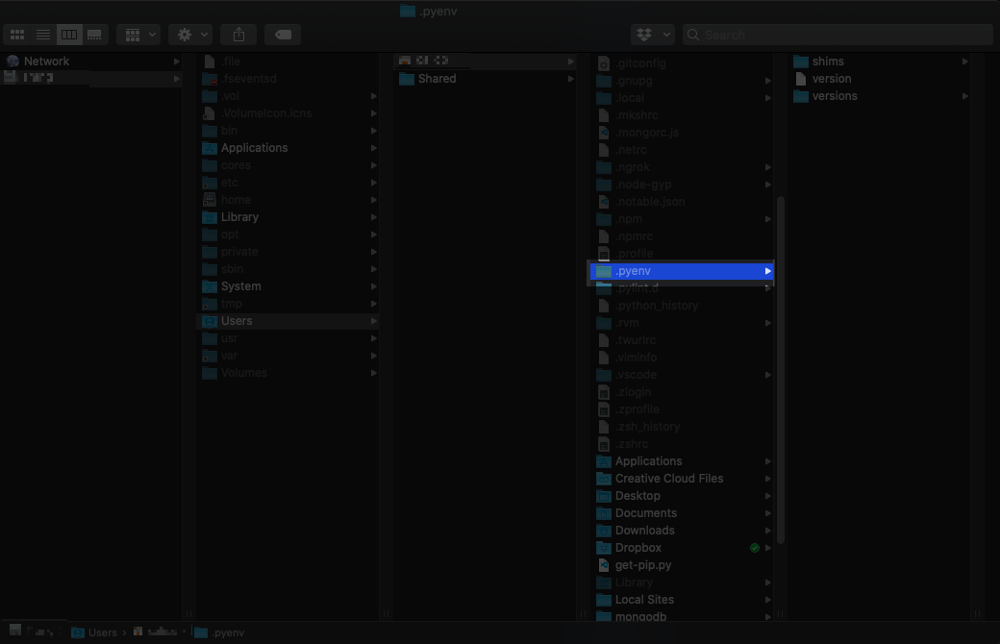
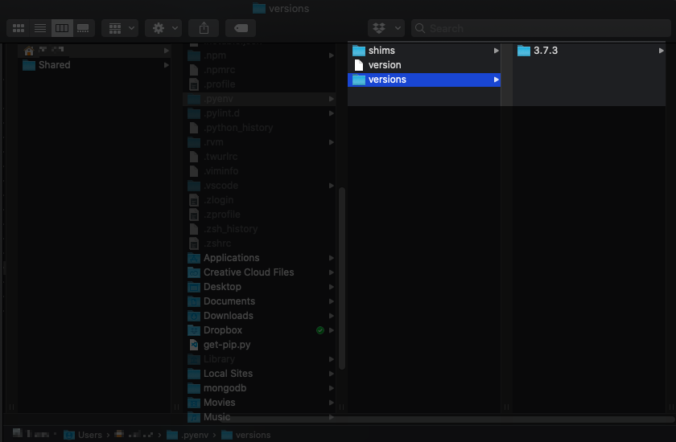
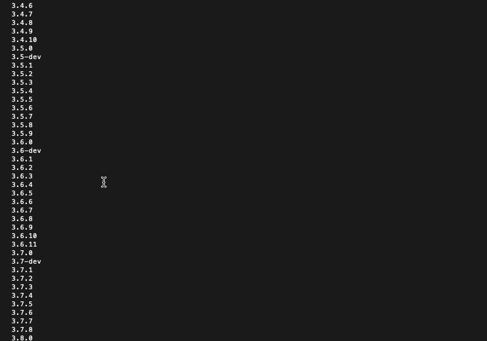
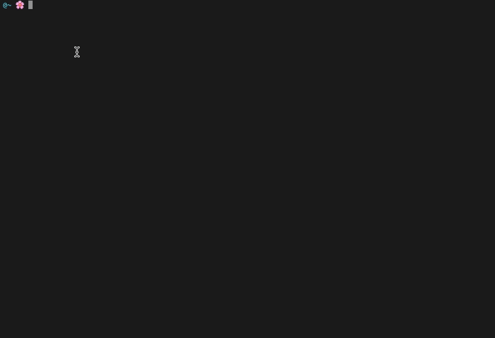

There are certain processes I've been doing that I know are inefficient, but I stick with it out of laziness. 

I'm talking about Python 3. I've been using it on and off for a few years but never set it as my default version. 

I have multiple Python versions which I can't keep track of, and a few Python interpreters which require me to google frantically every time I run them, because I just don't use them frequently enough to remember

However, with the bittersweet “departure” of Python 2, I think it's time to do it properly.

Don't be fooled by the task name. Just like many things in programming, there are several ways to set default Python version, but some are more inefficient than others. 

If you are wondering what the best method it, please read on. 

## Install pyenv

You may wonder: Why should I install another software again? Why not firing up the terminal and setting the path to python 3 like this:

```bash
echo "alias python=/usr/local/bin/python3.7" >> ~/.bashrc
```

It certainly works, but you will have to remember to download future updates to Python, because there is no automatic way to do it, as the case with updating your Mac operating system. We programmers don't lack cool things we want to do. Who has time for another manual task?

That's why Pyenv comes in handy. It does what it promises: a simple tool to manage different Python versions.

Now, open up your terminal and install Pyenv with homebrew:

`brew install pyenv`

Once the installation is completed, go to your home directory and you should see a `.pyenv` folder created fresh off the bat.



## Initialize pyenv

In the terminal, run the following command to enable shims and autocompletion.

```bash
echo -e 'if command -v pyenv 1>/dev/null 2>&1; then\n  eval "$(pyenv init -)"\nfi' >> ~/.bash_profile
```

This will insert a `.pyenv/shims` into the `PATH` variable to redirect to the correct version of Python.

To verify this, type `echo $PATH` into the terminal and you should see a path along the line of `/Users/yourname/.pyenv/shims`.

Next, restart your shell so that the changes take effect.

```bash
exec $SHELL
```

## Install Python 3

You've probably installed a few variations of Python 3 on your Mac, but you still need to install it into the `$(pyenv root)/versions` directory.

You could specify the Python version that you want to install like this:

```bash
pyenv install 3.7.3
```



But here's a better way: Use grep command to retrieve the latest stable Python version and tell pyenv to install it.

How can we do that?

If you type `pyenv install --list` into the terminal, you should see a list of Python versions and interpreters available for installing.



That's one gigantic list. To narrow down to Python versions only, pipe the above command to `grep -v -` and `grep -v b`.

```bash
pyenv install --list | grep -v - | grep -v b
```

The v flag in the `grep` command means inverse search. In a nutshell, we tell the system to search for lines that don't contain the hyphen or the word `b`, short for beta.


From this list of Python versions, how do we restrict it to the latest version only? Pipe a `tail` command.

The `tail` command prints the last 10 lines of an input by default. `tail -1`returns the very last line of the input, which is 3.8.5 at the time of writing.

```bash
 pyenv install --list | grep -v - | grep -v b | tail -1
```

Voila



When you read this article, the number will definitely change, but you can use the above command to make sure to always grab the latest version.

Here's the final command to install:

```bash
pyenv install $(pyenv install --list | grep -v - | grep -v b | tail -1)
```

Now, run `pyenv versions` to see a list of all Python versions installed on your machine.

## Set Python 3 as the default

Here comes the most anticipated part, which turns out to be quite anticlimactic.

You can see any Python version as the default with this command:

```bash
pyenv global 3.8.5
```

And how can we check which Python version is active?

If you type the common command `which python`, you'll get a result like `/home/yourname/.pyenv/shims/python`. But wait, should we get the version number?

That took me by surprise, but then I learned that from MacOS's perspective, it is the executable that is getting called to run Python. 

This is actually just a redirect link. Your Python version is not located there. To get the actual path to it, run `pyenv which python`. You will get a result like `/home/yourname/.pyenv/versions/3.8.5/bin/python`.

And one more command before we part ways. 

## Useful pyenv commands

`pyenv version`: See the list of Python versions installed on the system

`python -V`: See which python version is set as the global