Why am I even writing about `float` property in 2020 when there are newer, cooler techniques for laying out web pages?

That's because I was intimidated by float when I started to learn CSS, and I never took the time to understand it properly. Recently, one of my design projects require the use of `float` and my laziness has come back to bite me.

Secondly, after spending a day figuring out float, I have realized that float is scary because many designers, including me, use it for what it was not intended to be.

As your web page grows organically, you start to see unexpected side effects of `float` that take too much time to fix.

So, it's time for me to clear up my misunderstanding and put `float` back to good use.

## Introduction

Let's be clear. The original intended purpose of float was to mimic the text wrap effect often seen in print design.

To float an element, you set a width for it and apply `float: left` or `float:right`.

```css
img {
	width: 40%;
	float: left;
	margin-right: 2rem;
.first-paragraph {
  background-color: rosybrown;
}
```

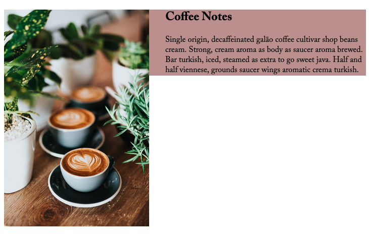

## How floated elements are positioned

The floated element is shifted to the left, or right, until it touches the edge of its containing box, as seen in the picture above.

If there is a second floated element, it will touch the edge of the first floated element.

For demonstration, let’s replace the long paragraph with a short heading and try floating it to the left, or right.

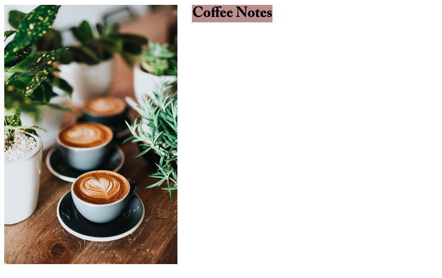

## Does floated element need a specified width?

Technically speaking, you don’t have to specify width for the floated element, except for images.

Images always come with predefined width and height. If no width is set, the image will take up as much space as it is supposed to do, and you won't see the text wrap effect.

Here’s one interesting thing when you reduce the opacity of the image.

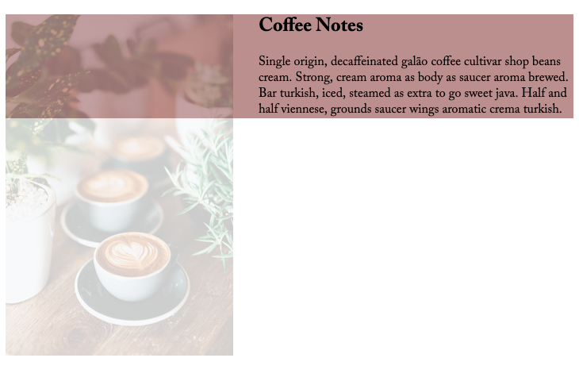

The Coffee Notes section is a block element, and it takes up all the space available to it.

However, we can still see the text wrap even though we don’t specify any width for the Coffee Notes section is because we had set a width for the image that is smaller than the viewport.

What if the second element is also floated? Let’s consider these two scenarios.

### When the second floated element has a lot of content

Let’s try to float the Coffee Notes section to the left.

```css
.first-paragraph {
	float: left;
```

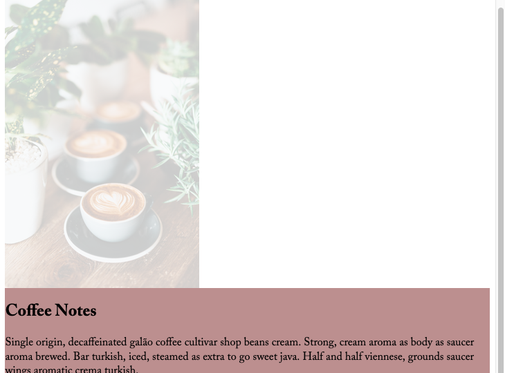

Coffee Notes has two choices:

- either stack up to the right side of the image
- or touch the left edge of its container

However, it can’t do the former because float implies the use of block layout.

Whether the Coffee Notes is a block or inline element, it will turn into a block once it has been floated.

And block element means stretching to the available space of its parent.

Hence, it will move to the bottom of the the image so that it can honor the float property while maintaining its width.

### When the second floated element has little content

Now, let’s remove the paragraph and leave only the Coffee Notes heading.

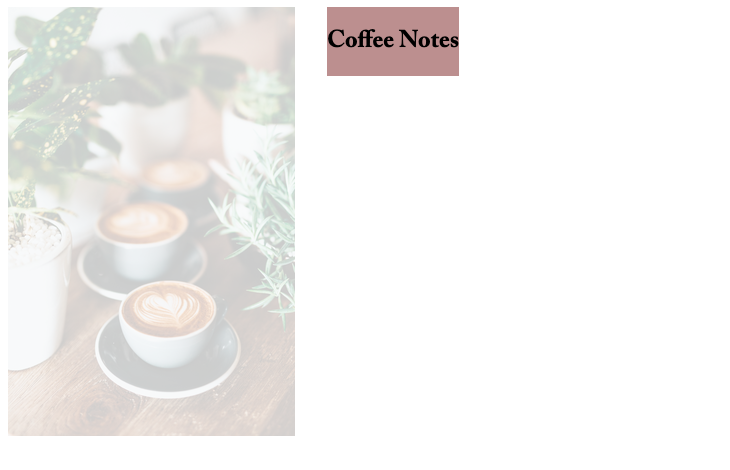

Coffee Notes is a block element, but it has been floated, and will take up only as much space has its content.

That’s what we have to pay for not specifying the width of a floated element. Let’s remedy this:

```css
img {
  float: left;
  width: 40%;
  margin-right: 1.5rem;
  opacity: 0.2;
}
.first-paragraph {
  float: left;
  width: 50%;
  background-color: rosybrown;
}
```

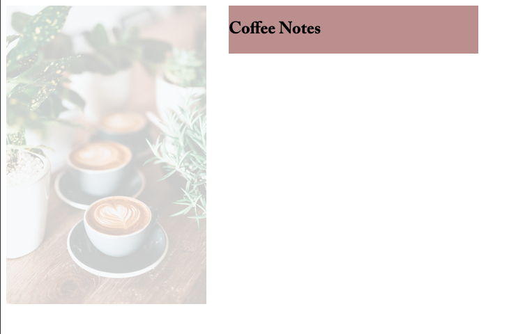

You may wonder what’t the point of this if Coffee Notes has no background color and wouldn't affect the aesthetic of the whole page.

Let’s add the paragraph back to the Coffee Notes section.

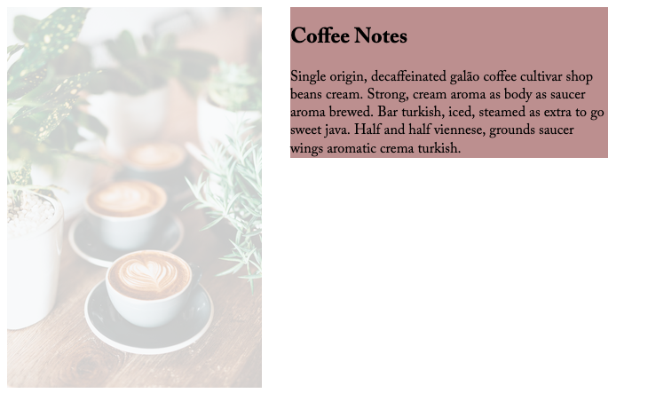

Surely this looks much better than having Coffee Notes shifted to the bottom of the image, leaving an awkward white space, right?

**Bottom line**: A floated element with undefined width is too unpredictable for its own worth. You never know how large or small your content will be, so always set the width of the floated element to percentage or viewport if possible.

## When all the children elements are floated

Okay, you may be asking: Floating two elements to the left is no different than floating only one element and let the non-floated element wrap around it.

True. The example above only serves to help me, and hopefully you, understand the mystified float.

When you apply float to more than one elements, that means you probably want to do some fancy layout. And that scenario rarely calls for only two floated element.

Let’s add another column and float it to the left.

```css
.second-paragraph {
	float: left;
	width: 30%;
	background-color: lemon chiffon;
```

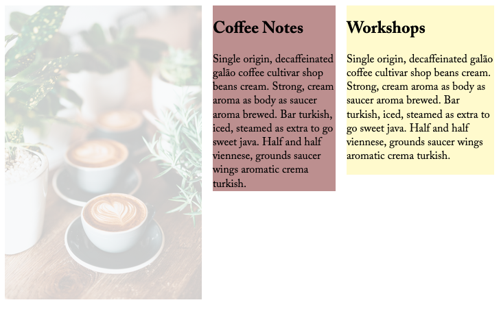

## Floated elements are taken out of the normal flow

That’s what most tutorials for float property tell you. But what does it mean?

Actually, in the image below, I have applied a crimson background to the container that holds the image, and the two text columns. Yet we can’t see anything because the container height has shrunk to zero.

This only happens when a parent element contains nothing but floated element.

At first, you won’t notice it, especially if you didn’t apply a background color to the parent.

However, this quirk becomes more obvious when the parent has a non-floated element.

Let’s add a third paragraph with no float property applied.

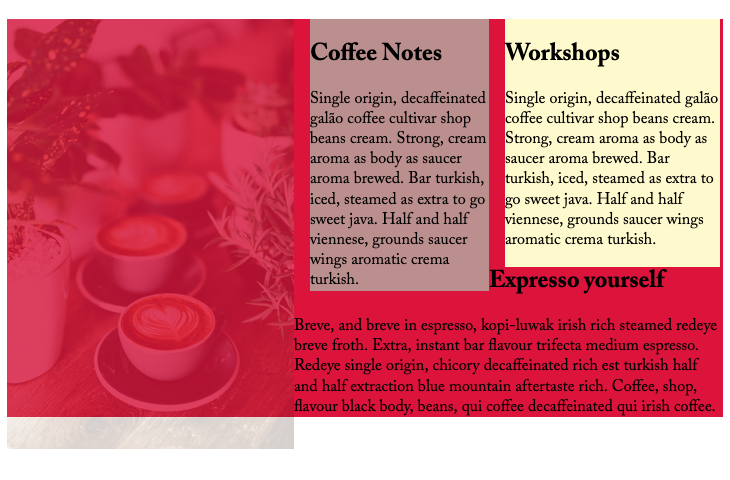

Now, you can finally see the crimson color here, but This looks like a nightmare for any CSS practitioners.

At the very least, we can see that the parent container is only as high as the minimum height of the non-floated element, which is the Expression yourself column.

It moves up to occupy the available space of the container while respecting the float.

At first, I thought this is a flaw of the float property, but the alternative is even worse. If the parent were to stretch to the bottom of its floated children by default, there will be a huge gape between the floated and non-floated. I can’t think of many scenarios in layout that would call for that effect.

## Clearing the float

Certainly no one wants the scenario above. How do we remedy that? Again, there are two situations to consider here.

### If the non-float is sibling with the floated elements

This is simple. You simply apply `clear` to it. It is the sister property of `float`. By doing this, you are telling the non-floated element to ignore the text wrap.

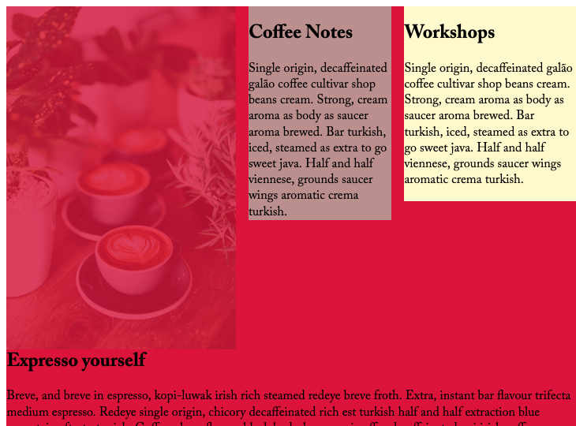

We can clear the float by using a pseudo element for the container of the floated element.

### If the non-float is on the same level as the parent of the floated elements

This is trickier, and unpredictable because the parent’s height shrinks to zero, and the floated elements’ height depend on how much width they are given.
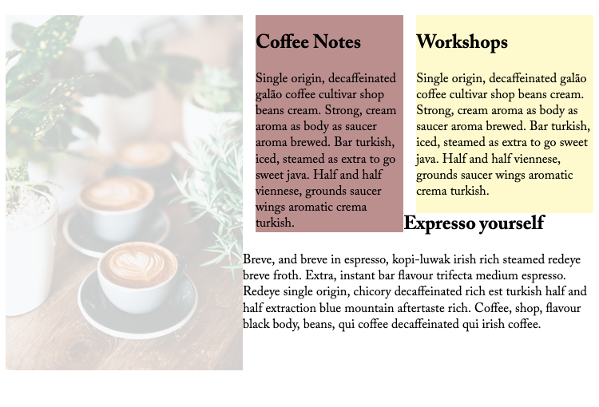

Here are two methods for clearing the float. I won’t bother with setting a specific height for the parent, because it is inflexible and not worth it.

**Method 1: Float the parent. **

```css
.content {
	float: left;
	background-color: crimson;
```

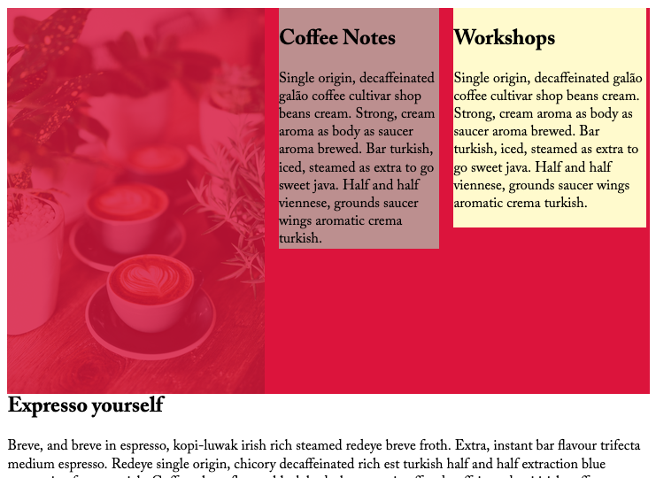

This method is simple, but it raises the question: What about the parent’s parent? Parent’s great-grandfather?

As your design project becomes more intricate, must you float all the way to the topmost ancestor element?

Otherwise, as you add more elements to your page overtime, you may wonder why they are not positioned as you expected?

\*\*Method 2: Apply a pseudo element to the parent.

```css
.content::after {
	content: "";
	display: block;
	height: 0;
	clear: both
```

## When should you use `float`?

While I won't use `float` to layout an entire web page, I think it is still useful for layouts in small instances.

The most obvious use for `float` is to use it the way it was meant to be: image wrap.


But `float` can do more than that. For example, drop caps are usually achieved with `float`. There's no need to crack a walnut with a sledgehammer.

Look how nicely the paragraph expands, or shrinks as you change the drop cap size. You won't be able to achieve this with absolute positioning.

You can also see float in asymmetrical layout, like below.


